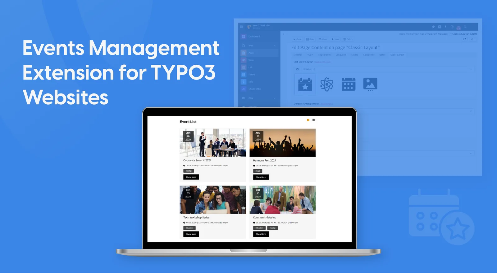

## NS Event

## What does it do?

Typo3 ns_event extenion create, schedule, and promote events effortlessly. Our user-friendly interface allows you to set event details, including dates, times, locations, and descriptions, in just a few clicks. You can also customize registration forms.

## Helpful Links

<Note>

- **Product:** https://t3planet.de/typo3-event-typo3-extension-pro
- **TYPO3 Backend Live Demo:** https://demo.t3planet.de/live-typo3/t3t-extensions/typo3/?TYPO3_AUTOLOGIN_USER=editor-event
- **Front End Demo:** https://demo.t3planet.de//t3t-extensions/event
- To make any domain-related changes or whitelist any development and staging domains, please reach our support center: https://t3planet.de/support

</Note>
