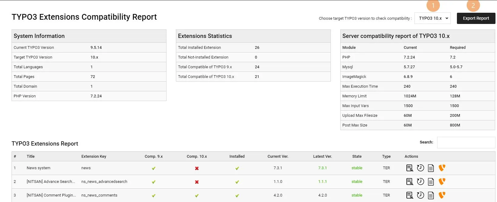
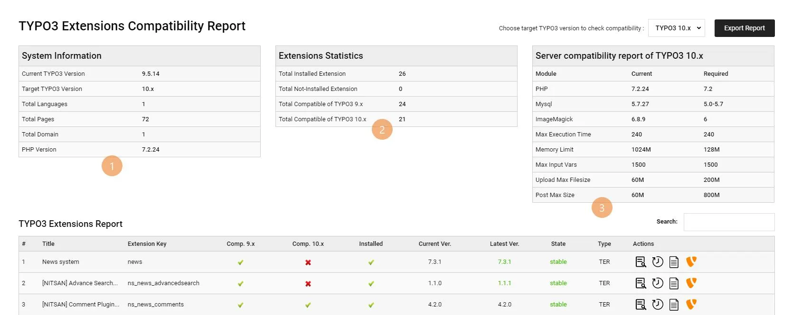
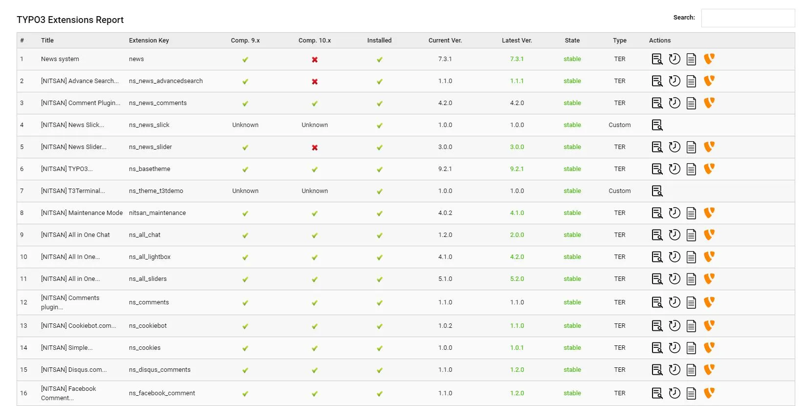

## User Manual

## 1. Select TYPO3 Target version and Export Feature

Now you may able to access backend module at **ADMIN TOOLS > Extensions Report**

1. You can select your target TYPO3 version to generate report.

1. By clicking on *"Export Report"* button, Extension will export whole report in Excel sheet format

## 2. System Information, Extensions Statistics, Server compatibility report

1. The **System Information** section shows general overview report.

1. **Extensions Statistics** section shows statistics of extensions eg., How many extensions are installed?

1. **Server compatibility report** section shows the comparison of "server compatibility" between installed and target TYPO3 version.

## 3. TYPO3 Extensions Report

Here, you can see list of all the TYPO3 extensions with checking compatibility, available new version, variance actions eg., history of extension, versions etc.,

## 4. Actions And Results

This part shows which icon contains what kind of effect in it.

==================== ============================== =======================================================================================
Icon                 Action                         Description
==================== ============================== =======================================================================================
          **Compatible OR Installed**    The currently installed extension version is already compatible with LTS version of

TYPO3 CMS or Installed in to system.
         **Non-Compatible OR**          The currently installed extension version is not compatible with LTS version of
**Not-Installed**              or not installed in to system.

          **Extension Details**          It will show all the details of the extension which you have clicked like Extension Key,
Description, Last Updated Comment, Last Updated Date, etc.

       **Extension Version Details**  It will show all the details of the extension as well as all extension's versions which
uploaded at TER.

 **Documentation**              It will redirect you to the TER Doccumentation page which you have clicked.

          **TER Extension**              It will redirect you to the **https://extensions.typo3.org** of respective extension.
==================== ============================== =======================================================================================
