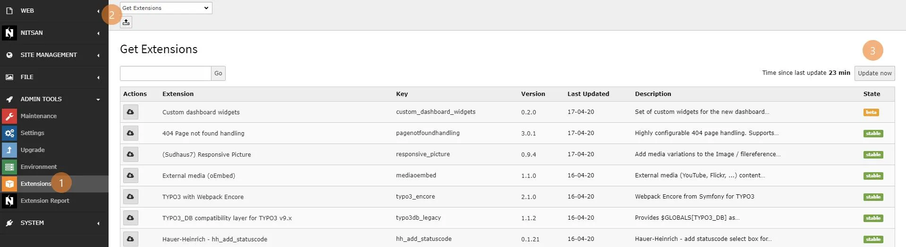
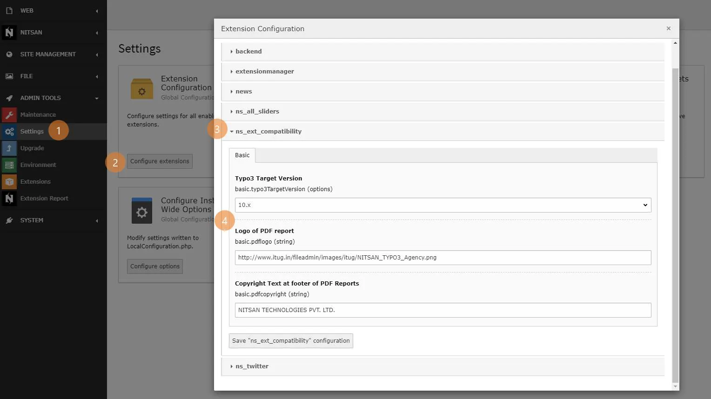
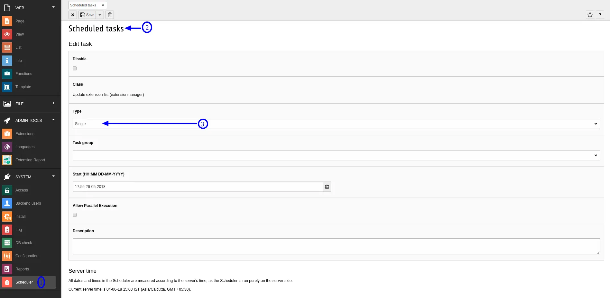
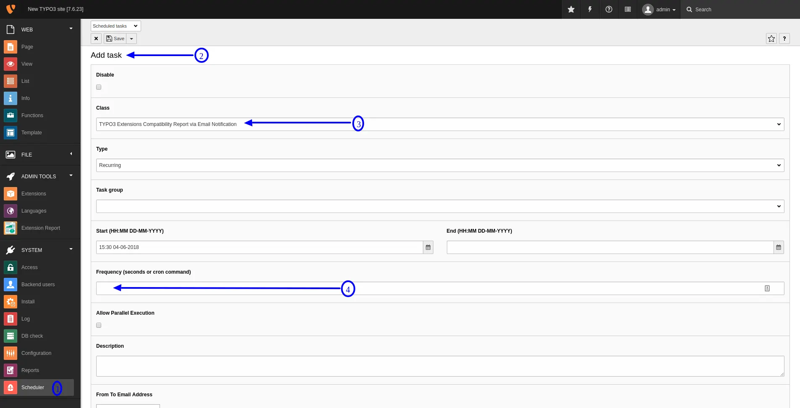
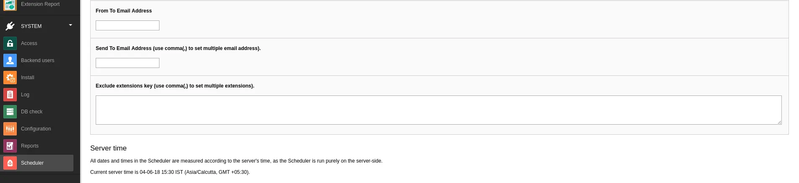

# Configuration

## 1. Compulsory: Update Extension Repository

> To make works perfect this extension, It's very important to-do perform this task. By the way, you can also setup scheduler to make it automatically update ;) You can easily update extension repository with following simple steps:
>
>
> 1. Go to “Extension Manager”.
> 2. Select "Get Extensions" from Dropdown
> 3. Click on 'Update Now' button
>

## 2. Optional: Set default target TYPO3 version

## 3. Optional: Configure Scheduler

>
> 1. Go to SYSTEM > **Scheduler** > Create new scheduler with **Update extension list (extensionmanager)**.
>

>
>
> 1. Go to SYSTEM > **Scheduler** > Create new scheduler with **TYPO3 Extensions Compatibility Report via Email Notification**, It will automatically send you an email whenever new TYPO3 version or extensions will available, Please configure all the fields.
>

>

That's it, Now you can enjoy all the benifits of this extension :)
