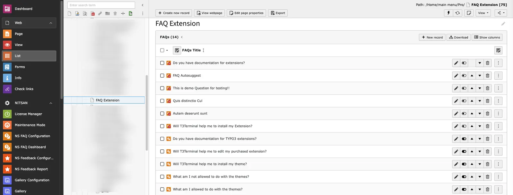
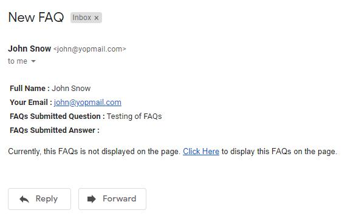

Once any visitor submit a FAQ from FAQ Submission Form, Admin will get email Notification of new FAQ. By default, visitor's FAQ will be disabled. When this FAQ becomes enabled, it will be displayed on Frontend.

## How to enable visitor's FAQ?

Admin can enable FAQ with 2 ways:

**1. Enable from Backend:** Visitor's FAQs are stored in Storage folder set in FAQ Plugin. Admin need to go to that Storage folder and enable the visitor's FAQ. Once admin enable this comment, it will be automatically displayed at fronted.

**2. Enable from E-mail:** Admin will get email when visitor add FAQ. At the bottom of the email, there is one link from where admin can enable FAQ. When user click on that link, he/she will be redirected to FAQ page and upon reloading teh FAQ page, FAQ will be enabled.

