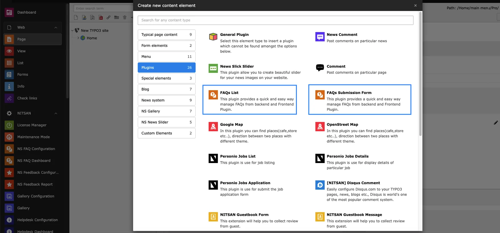
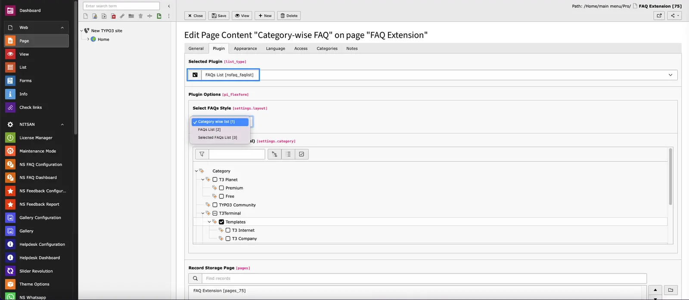

To display FAQs at frontend, you need to add FAQs plugins for FAQ list and Submission form.

Once you add FAQ plugins you can configure how to display FAQs at frontend.

## FAQs Submission Form

- **What would you like to display?:-** Here you can either select FAQs Submission Form. List option will display FAQs at frontend.
- **Record Storage Page:-** Select Storage pages where FAQs/Categories are stored.

## FAQs List

- **Select FAQs Style:-** Here you can decide how to display FAQs. There are 3 options:
  : 1. **Category wise List**: You can display all the FAQs of selected categories & sub-categories. FAQs will be grouped by Category.
    2. **FAQ List**: You can display all the FAQs stored in Record Storage page.
    3. **Selected FAQs List**: You can display list of Selected FAQs.
- **Record Storage Page:-** Select Storage pages where FAQs/Categories are stored.
