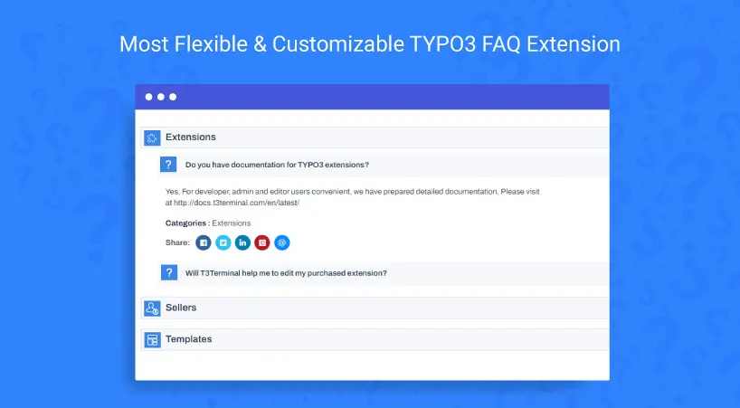

## NS FAQ

## What does it do?

Ultimate FAQ TYPO3 Extension is an easy-to-use and customizable extension to shape and display on your website a list of the most frequent customer questions with answers. Informative and easy-to navigate FAQ extension helps to anticipate clients' enquiries and reduce time and cost of Support team. Using this FAQ may also help share more details about your products and services, focus attention on their benefits, and and eliminate any possible misconceptions and doubts to increase your sales.

## Helpful Links

<Note>

- **Product:** https://t3planet.de/ns-faq-typo3-extension
- **TYPO3 Backend Live Demo:** https://demo.t3planet.de/live-typo3/t3t-extensions/typo3/?TYPO3_AUTOLOGIN_USER=editor-faq
- **Front End Demo:** https://demo.t3planet.de//t3t-extensions/faq
- To make any domain-related changes or whitelist any development and staging domains, please reach our support center: https://t3planet.de/support

</Note>
