Once you create a Template for FAQ, you will find a new Backend modules for FAQ in Sidebar. This modules will be used for all the configuration of FAQs. This Modules provides complete management of FAQ.

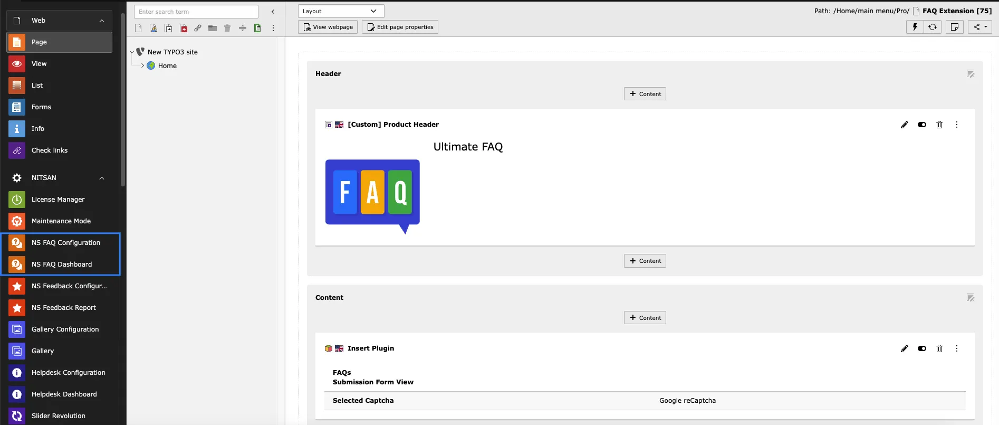

This Modules contains different tabs for all kind of FAQ Configurations. Let's understand how each Modules works one by one.

## NS FAQ Dashboard

This Module contains 3 different tabs for FAQ Configurations. Let's understand how each tabs works.

### Dashboard

This is the first tab in NS FAQ Dashboard and as name suggest, it shows dashboard of complete module. It highlights overview details of FAQs. It also specifies number of FAQs, Latest FAQs, handy links for documentatiuon, support etc.

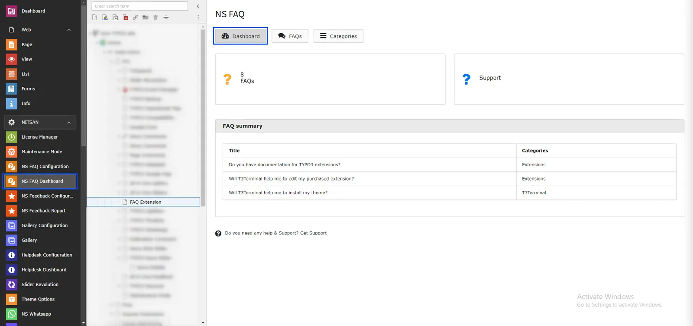

### Categories

This tab is used to manage Categories of FAQ. This extension allows user to create system categories and assign these categories to FAQs for better management of FAQs.

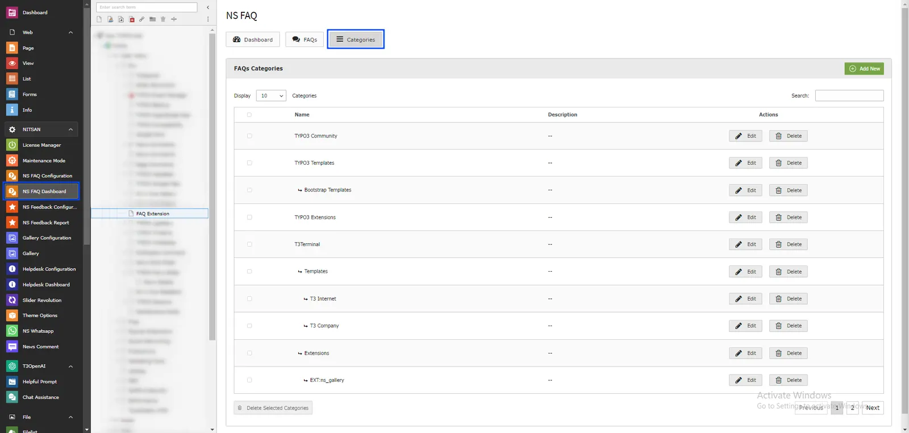

- Add New button at top-right allows user to create new system category. Upon clicking, it will open a form where user can add system category.
- Categories table shows list of all existing categories similar to category tree structure. From here, user can edit or delete individual category using Edit and Delete button.
- User can also delete multiple categories by selecting categories by checkbox and clicking on Delete Seleted Categories button below table. User can alo search categories from searchbox.

### FAQs

This tab allows user to create and manage FAQs.

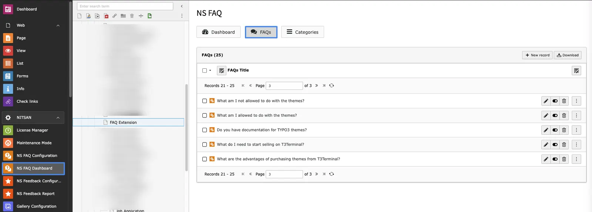

**Create FAQs using RTE**

- Add New button at top-right allows user to create new FAQ. Upon clicking, it will open a form where user can set FAQ Title, FAQs Content (Answer), Category and FAQ submitter's name and email.

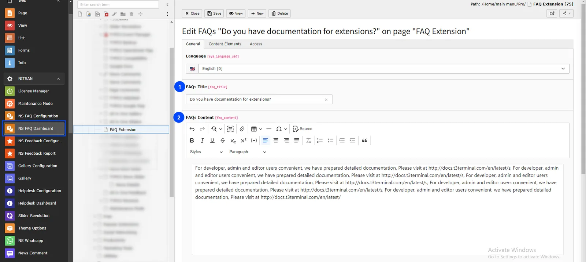

**Create FAQs using Content Elements**

- You can also add Default Content elements as Answer of the FAQ. To set content element, go to Content Elements tab in FAQ record and click on Create New button. From there you can select content element and set appropriate content.

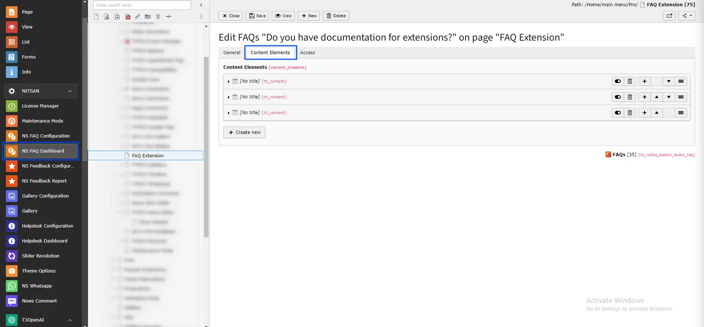

- FAQs table shows list of all existing FAQs. From here, user can edit or delete individual FAQ using Edit and Delete button.
- User can also delete multiple FAQs by selecting FAQs by checkbox and clicking on Delete Seleted FAQs button below table. User can alo search FAQs from searchbox.

## NS FAQ configuration

This Module contains 3 different tabs for FAQ Configurations. Let's understand how each tabs works.

### Basic Settings

This tab is used to set basic settings of the FAQs like how FAQs should work, what will be displayed and how FAQs will be ordered.

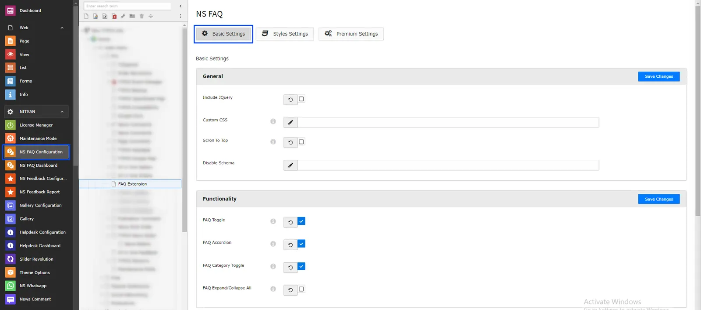

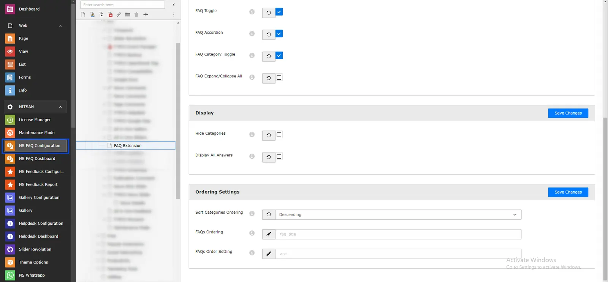

**General**

- Custom CSS:- Here user can set custom CSS for FAQ to match it with website's theme.
- Scroll to Top:- If user keep this On, It will show Scroll to Top icon at bottom-right of FAQs

**Functionality**

- FAQ Toggle:- If this is On then user will be able to expand/collapse FAQs. If it is off then all FAQs will be displayed expanded and visitor will not be able to collapse it.
- FAQ Accordion:- If this is On then user will be able to expand only one FAQ at a time. If it is off then user can expand multiple FAQs at a time.
- FAQ Category Toggle:- It will determine if Categories can be toggled or not. If it is On then user can expand/collapse categories. If is off then Categories will be expanded by default and user cannot collapse it.
- FAQ Expand/Collapse All:- If it's on, "Expand All FAQs" link will displayed above Categories.

**Display**

- Hide Categories:- If it is on then Categories will not be displayed in FAQ Answers. If it is off, each FAQ Answer will display categories linked with it.
- Display All Answers:- If it is on then all FAQs will be displayed as expandind by default.

**Ordering Settings**

- Sort Categories ordering:- Here uer can decide in which order Categories should be listed at frontend. User can either select Ascending or Descending. **Note:** This will only work if no categories is selected in FAQ plugin and you want to show all categories. If categories are selected in FAQ plugin then the order in which they are selected in plugin will be the order in Frontend.
- FAQs Ordering:- It determines FAQs should be ordered based on Title or Category.
- FAQs Order Setting:- User can decide to sort FAQs in Ascending or Descending order.

### Styles Setting

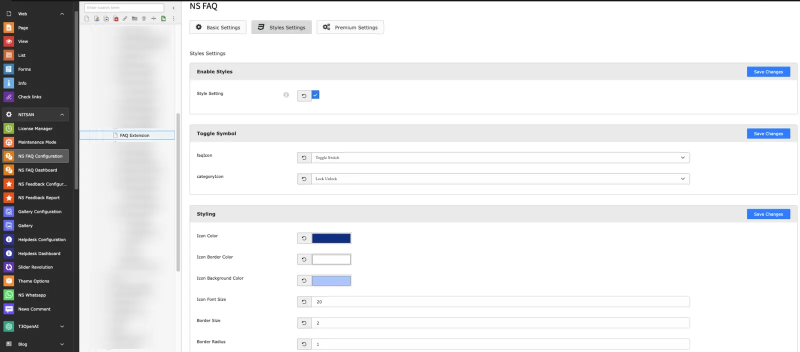

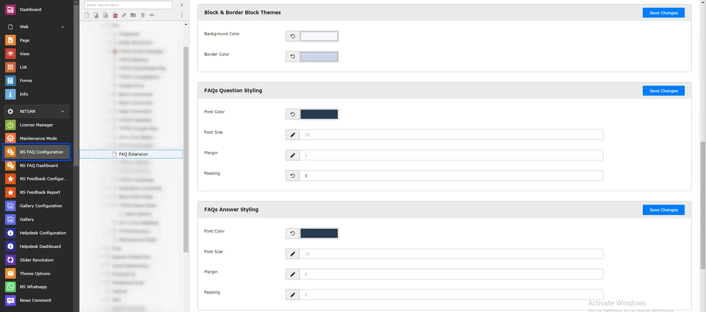

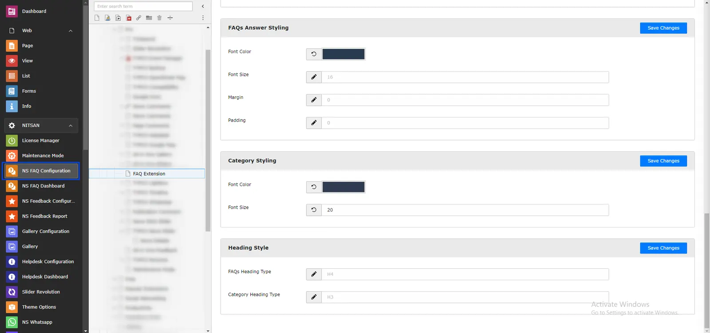

**Style Setting**

- Disable the defualt CSS styles if you want to use your own custom CSS.

**Toggle Symbol**

- FAQs Icon:- Select from variety of icons to display on FAQ while FAQ is Expanded or collapsed.
- Category Icon:- Select from variety of icons to display on Category while Category is Expanded or collapsed.

**Styling**

- Icon Color:- Select Icon color from Color picker.
- Icon Border:- Select color of Icon Border from Color picker.
- Icon background Color:- Select Icon Background Color.
- Icon Font size:- Set Icon size. It is suggested to keep it b/w 16 to 26.
- Border size:- Set Icon's Border size.
- Border Radius:- Set Icon boxe's radius.

**Block & Border Block Themes**

- Background Color:- Set Background color to display for Question. **Note:** This will only work if FAQ Display Style is Default in Premium Settings.
- Border Color:- Set Border Color to display for Question. **Note:** This will only work if FAQ Display Style is Border Block in Premium Settings.

**FAQs Question Styling**

- Font Color:- Set font color for question.
- Font Size:- Set font size for question.
- Margin:- Set margin b/w questions.
- Padding:- Set padding to add for question.

**FAQs Answer Styling**

- Font Color:- Set font color for answer.
- Font Size:- Set font size for answer.
- Margin:- Set margin for answer.
- Padding:- Set padding to add for answer.

**Category Styling**

- Font Color:- Set font color for category
- Font Size:- Set font size for category.

**Heading Style**

- FAQs Heading Type:- Set heading type for FAQs. You can select b/w H1 to H6.
- Category Heading Type:- Set heading type for Category. You can select b/w H1 to H6.

### Premium Settings

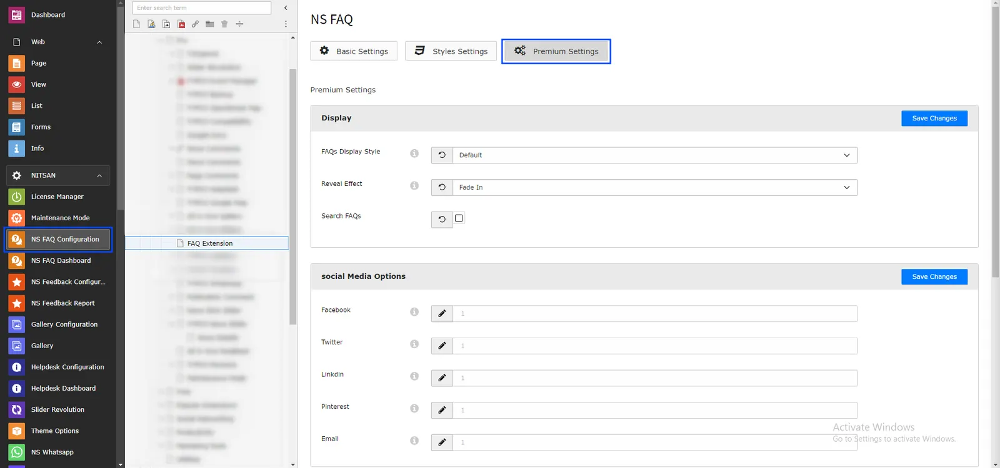

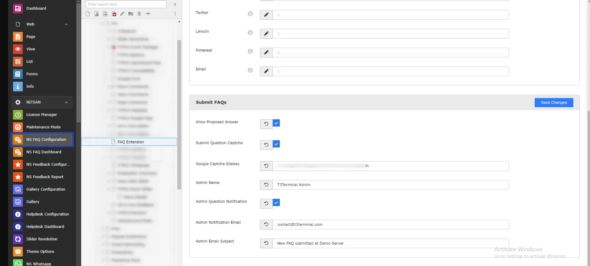

**Display**

- FAQs Display style:- This option is used to select layout of the FAQ. User can either use Default option where FAQ question will have background color or Border Block option where FAQ Question will have transparent background and colored border. **Note:** Background Color or Border Color for these option will be set in Block & Border Block Themes section in Styles settings tab.
- Reveal effect:- These drop-down will allow user to select animation effect for answer when answer is expanded. User can select from various animation.
- Search FAQs:- If it is on, a Search box will be displayed above FAQs where user can search from FAQs.

**Submit FAQs**

In this section, you can configure settings for Submit FAQ Form.

- Allow Proposed Answer:- If this is On, Proposed Answer field will be displayed in Form.
- Submit Question Captcha:- If it is On, Captcha will be displayed in Form.
- Google Captcha Sitekey:- To display Google Captcha in form, set Google Captcha Sitekey here.
- Admin Name:- Set Admin name for email sent when visitor submits any FAQ.
- Admin Question Notification:- If it is On, Admin will get email notification when any visitor submits FAQ.
- Admin Email Subject:- Set subject of email to sent to Admin.

**General**

- Social Media Options:- Select which Social Media sharing icons to display on each FAQ Answer.
