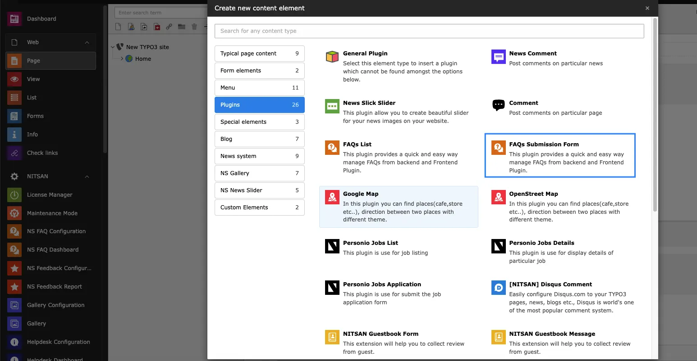
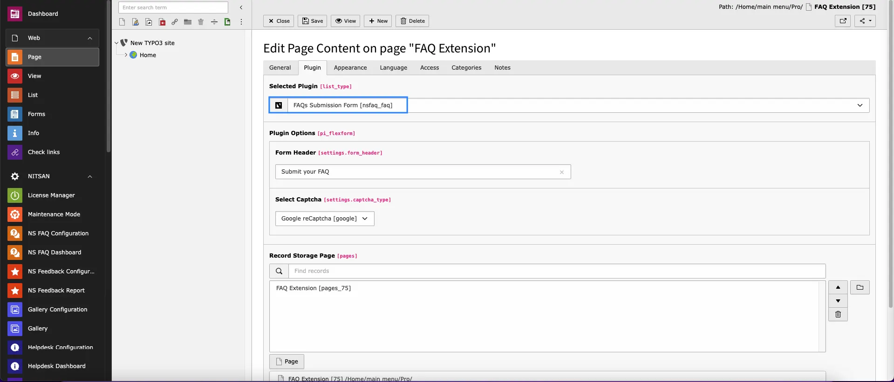

To add FAQ Submission form, you need to add FAQs plugin.

Once you add FAQ plugin you can configure how to display FAQ Submission Form at frontend.

- **What would you like to display?:-** Select FAQs Submission Form from drop-down.
- **Form Header:-** Set Form header you want to set.
- **Select Captcha:-** Here you can either select Image Captcha or Google reCaptcha. **Note:** Make sure to add sitekey for Google reCaptcha in Premium Settings tab in NS FAQs module.
- **Record Storage Page:-** Set Storage where Visitor's FAQs should be stored.
