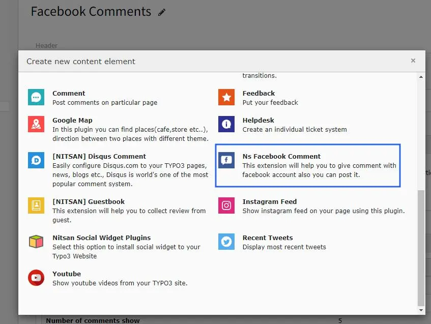
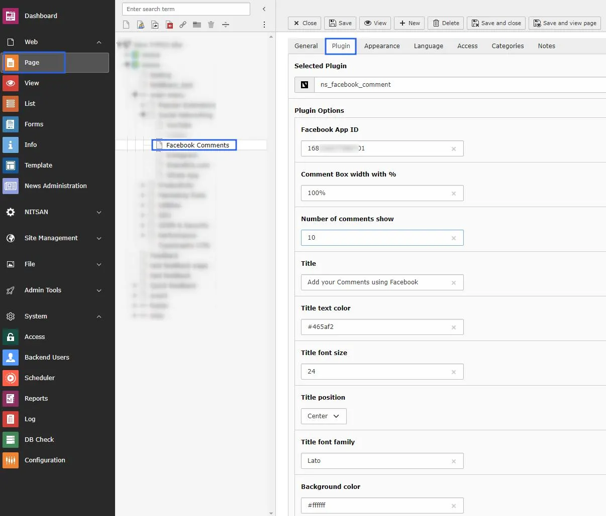

**Quick & Easy configuration of “Facebook Comments” into TYPO3**

To create the FB App ID for your TYPO3 site:

**Step 1:** Login to Facebook.

**Step 2:** Create App id for Facebook Comments from this URL https://developers.facebook.com/apps

**Step 3:** Plugin configuration

> **3.1:** Go to Page Module.
>
> **3.2:** Open the page where you want to add the plugin.
>
> **3.3:** Click on add content button and switch to Plugins tab.
>
> **3.4:** Now integrate it to the selected page.

**3.5:**

 Now just configure plugin with Facebook App ID and also Other fields as per requirements.

