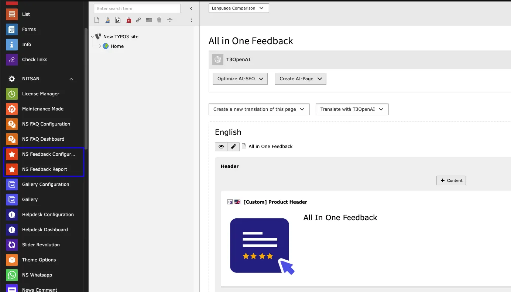
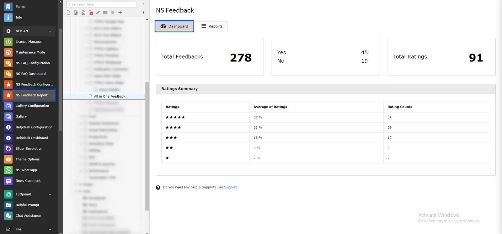
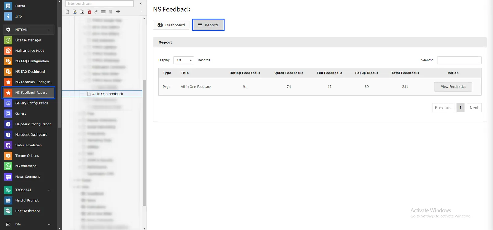
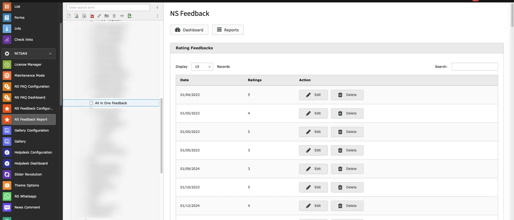
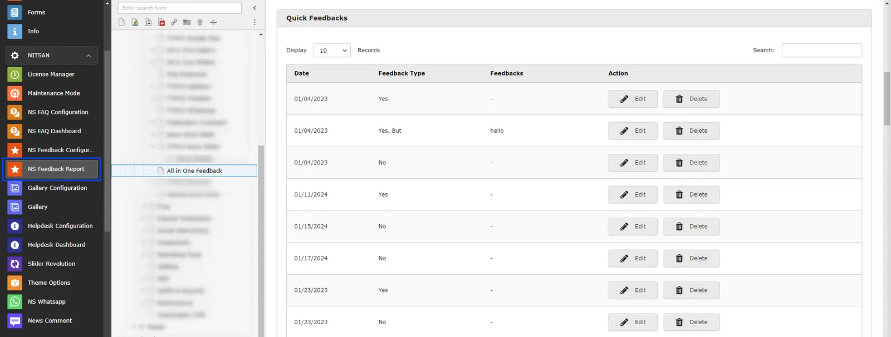
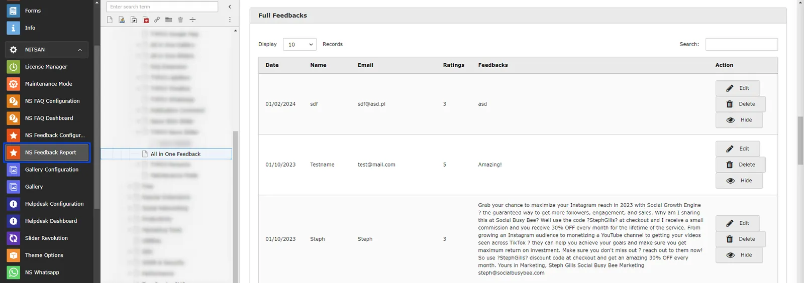
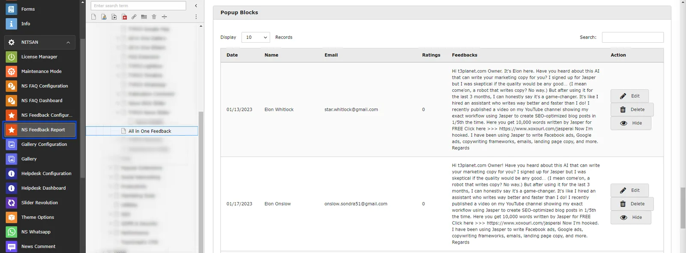
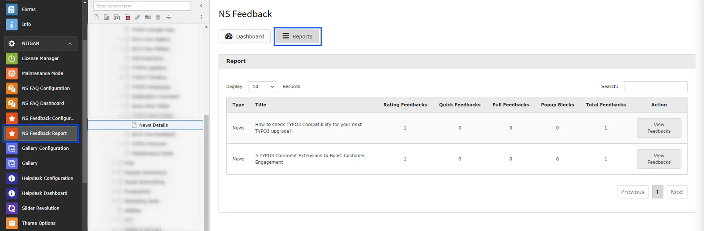
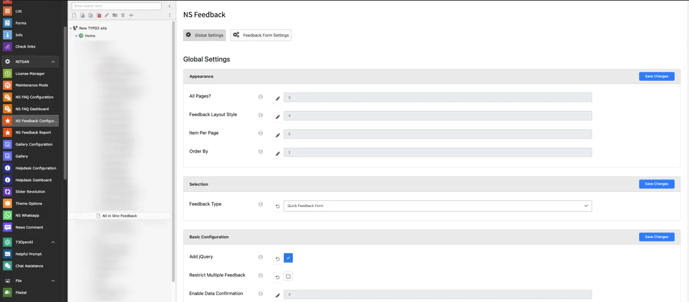
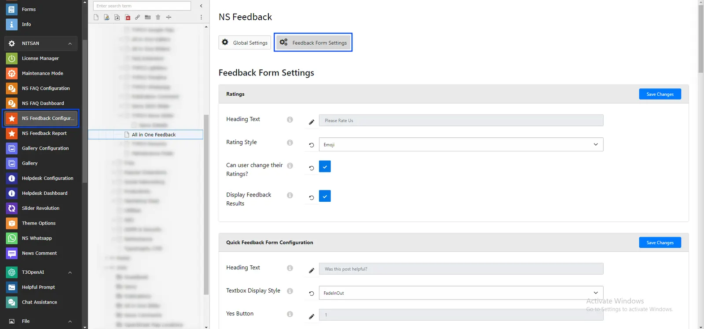

Once you perform installation process successfully, you will find two new Backend modules "NS Feedback Report and NS Feedback Configurations" in Sidebar. This modules will be used for all the configuration of all Feedbacks in your site. This Modules provides complete management of Feedbacks.

This Modules contains various tabs for all kind of Feedback Configurations. Let's understand how each module works one by one.

## NS Feedback Report

### Dashboard

This is the first tab in NS Feedback Report Module and as name suggest, it shows dashboard of complete module. It highlights total feedbacks received from visitors. It also displays how many ratings are received from visitors and summary of the ratings. It also displays how many "Yes" and"No" feedbacks are received from Quick Feedback Form.

<Tip>

Each page in site will have their own Dashboard and Reports tab in NS Feedback Module. It means that to see the Dashboard and reports for any page, you need to switch to NS Feedback module in sidebar and select the page.

</Tip>

### Reports

This is the most crucial tab for Administrator since all the detailed reports of Feedback forms are displayed here.

This tab will provide overview of all the feedback received in Current page. It will display how many feedbacks are received in each feedback form for selected page.

To see detailed report of each feedback form, click on "View Feedbacks" button. It will display all the feedbacks received in each of the feedback form used in the selected page.

<Note>

If you have added Feedback Forms at News Details page then you need to select News Details page from Page-tree after selecting NS Feedback module. Reports tab will display list of all the News records where feedbacks are received from visitors.

</Note>

It will look something like below:

## NS Feedback Configuration

### Global Settings

This module is used to configure Global Settings for the Feedback Forms. Here you can set Basic Configuration, Design Settings, E-mail settings and Thank you message settings.

- **Appearance**: Set this ON if you want to display selected Feedback form on all pages of the site. If this is OFF then Feedback Forms displayed through Plugin will be displayed.
- **Selection**: Select the default Feedback type. This feedback type will be displayed on all pages if All Pages option above is ON.

**Basic Configuration**: Here you can decide if you want to add jquery and whether to restrict visitors from posting multiple feedbacks.

**Design**: Here you can set design related settings of the Feedback form. You can set font style, color, button style, button background color and button Text color.

**Email Notification Settings**: Here you can set what mail to send to Admin and visitor when visitor submit any feedback.

**Thank You Message Configuration**: You can set what title and message to display in pop-up box when visitor submit the feedback.

## Feedback Form Settings

In this tab, You can configure all available Feedback Forms.

**Ratings**

- **Title Text**: Set Text to display with Ratings Feedback Form.
- **Rating Style**: Here you can select Rating style from Star, Emoji & Numbers.
- **Can user change their Ratings?**: If this ON, visitor can give rating again. If this is OFF then visitor will not be able to update the rating.
- **Enable Feedback**: Keep thi ON if you want to display Feedback Form results below feedback form.

**Quick Feedback Form Configuration**

- **Title Text**: Set Text to display with Quick Feedback Form.
- **Textbox Appear Style**: Set Animation to display while Feedback box is displayed
- **Select Buttons**: Check buttons to display in the Feedback form.
- **Enable Feedback**: Keep thi ON if you want to display Feedback Form results below feedback form.

**Full Feedback Form Configuration**

Here, User can set Field name, placeholder of the fieldsto display in Full Feedback Form. Also, user can decide whether fields should be displayed or not and fields should be required fields or not.

Additionally, user can set appropriate Submit Button text as well.

You can display visitors' feedbacks below Feedback form by turning ON Enable Feedback option.

**Popup Settings**

Here, User can set Field name, placeholder of the fieldsto display in Full Feedback Form. Also, user can decide whether fields should be displayed or not and fields should be required fields or not.

User can set appropriate Submit Button text as well.

You can display visitors' feedbacks below Feedback form by turning ON Enable Feedback option.

Additionally, User can set following configuration for Pop-up Feedback Form.

- **Popup Layout**: User can decide where to display Popup. User can select from following options: Left Bottom, Right Bottom, Left Sidebar, Right Sidebar
- **Popup Title**: Set title to display on Popup.
- **Popup Titlebar Text**: Set text to display on Popup Titlebar when popup is opened.
- **Popup Titlebar Color**: Set Titlebar color.
