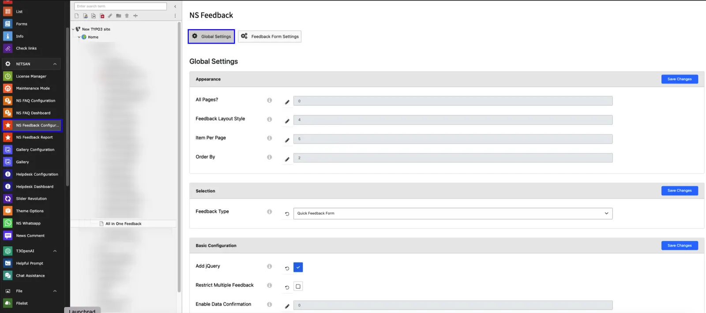

EXT:ns_feedback allows administrators to set one Feedback form to display throughout the site. To set this, user need to perform following steps:

- 1. Switch to NS Feedback Configuration.
- 2. Select the page where Template of the extension is added. Generally, it is set on Root page.
- 3. Go to Global Settings tab.
- 4. Set All Page field to ON.
- 5. Select Feedback Form which you want to display throughout the site in Feedback Type drop-down
- 6. Click on Save Changes button.

