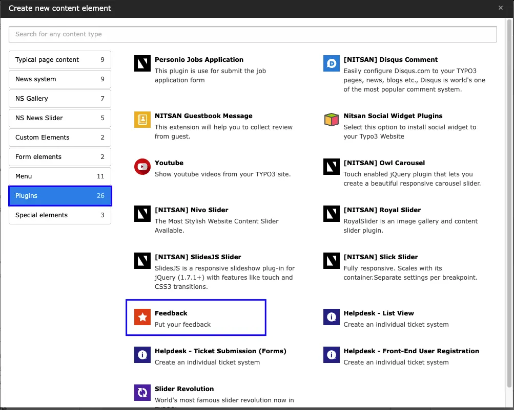
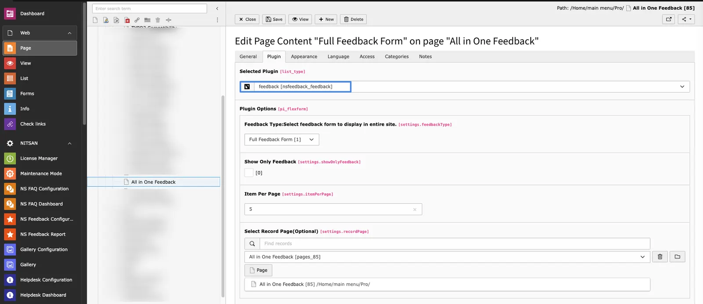

EXT:ns_feedback also allows administrators to set Feedback forms on individual pages as well. Depending on the requirement, user can set any of the Feedback forms on individual pages.

To add any specific Feedback form on any page, perform following steps:

- 1. Switch to Page module.
- 2. Select the page from page-tree where you want to add feedback form.
- 3. Click on Add new Content element button.
- 4. Go to Plugins tab and select Feedback Plugin.

- 5. Now, switch to Plugin tab and select Feedback form in Feedback Type drop-down.

<Note>

Adding Feedback form on page will not affect the feedback form set throughout the site. In this case, both feedback forms will be displayed and visitor can submit feedback on both Feedback forms.

</Note>
