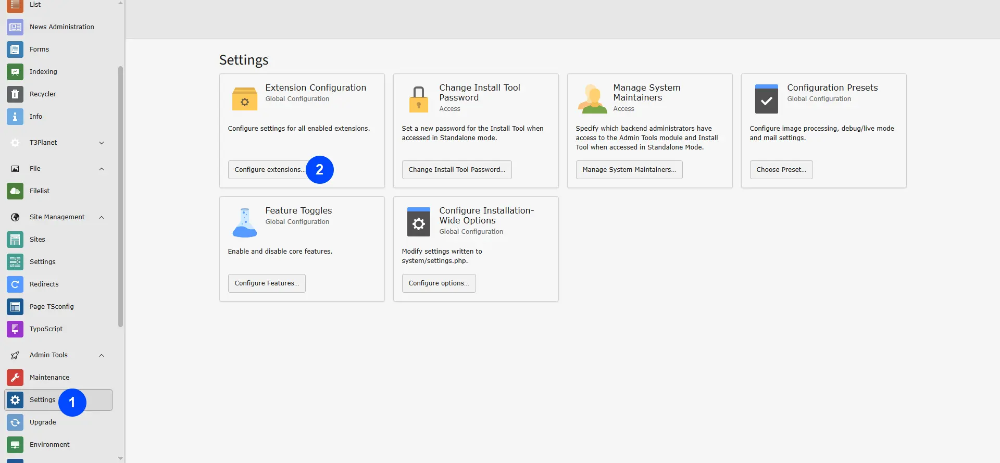
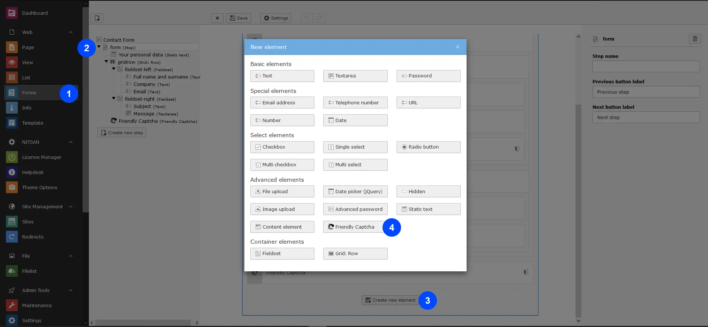
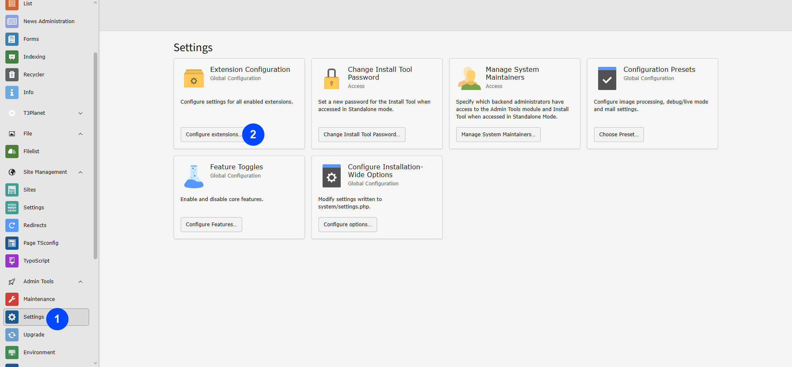
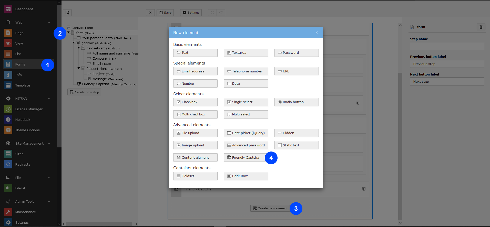

You can configure all the settings of ns_friendlycaptcha as described below:

- **Step 1:** Go to Settings.
- **Step 2:** Select configure extensions.
- **Step 3:** Select ns_friendlycaptcha.
- **Step 4:** Add Friendly captcha Site key.
- **Step 5:** Add Friendly captcha secret key,the secret key authorizes communication between your application backend and the friendlycaptcha server to verify the user's response. The secret key needs to be kept safe for security purposes..

<Note>

For generating the Site and Secret key, please refer to the following link:
[FriendlyCaptcha Documentation](https://docs.friendlycaptcha.com/#/installation?id=_1-generating-a-sitekey)

</Note>

- **Step 6:** Now, you can configure all the options which you want eg., Auto Check,Check on focus and Manual, See below screenshot.
- **Step 7:** While enabling the EU endpoint it gurantee that the personal Information (Like IP address) never leave the EU, learn more from here https://docs.friendlycaptcha.com/#/eu_endpoint
- **Step 8:** while Enable Puzzle Friendly Captcha protects forms using an invisible puzzle that runs automatically in the background. Users do not see or solve anything manually. The system adjusts the puzzle difficulty automatically, and the server checks the result to allow valid form submissions.

---

## Additional content from live docs

## Local & Staging Testing

If you want to test this extension on a local server without an official domain or IP:

- **Recommended:** Create a free Friendly Captcha account and generate a separate **development Sitekey/Secret Key** for local/staging use.
- Do not reuse your production key on a local server. Friendly Captcha production credentials are tied to specific domains registered in your account, so a mismatched domain will cause verification to fail.
- Use your **development key** for local/staging testing and your **production key** for the live domain.
- To whitelist a development or staging domain, contact our support center: [https://t3planet.de/support](https://t3planet.de/support)

