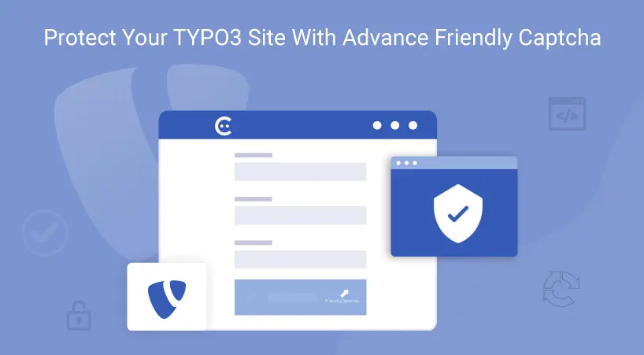

## EXT:ns_friendlycaptcha

## What does it do?

EXT:ns_friendlycaptcha is a TYPO3 extension that generate unique crypto puzzle for each visitor. As soon as the user starts filling a form it starts getting solved automatically. Solving it will usually take a few seconds. By the time the user is ready to submit, the puzzle is probably already solved. it prevent spammers and hackers from inserting dangerous or frivolous code into online forms.

## Prerequisites

Before installing this extension, you need a Friendly Captcha account to generate your Sitekey and Secret Key.

- Create a free account at [https://friendlycaptcha.com/](https://friendlycaptcha.com/) — click **Sign up** and follow the registration steps.
- The T3Planet extension itself is free to use.
- Friendly Captcha’s service includes a free tier with a monthly verification limit. For pricing beyond the free tier, see [https://friendlycaptcha.com/#pricing](https://friendlycaptcha.com/#pricing)

## Helpful Links

<Note>
- Product: [https://t3planet.de/en/typo3-friendly-captcha-extension](https://t3planet.de/en/typo3-friendly-captcha-extension)
- TYPO3 Backend Live Demo: [https://demo.t3planet.de/live-typo3/t3t-extensions/typo3/?TYPO3_AUTOLOGIN_USER=editor-friendly-captcha](https://demo.t3planet.de/live-typo3/t3t-extensions/typo3/?TYPO3_AUTOLOGIN_USER=editor-friendly-captcha)
- Front End Demo: [https://demo.t3planet.de/t3t-extensions/friendly-captcha](https://demo.t3planet.de/t3t-extensions/friendly-captcha)
- To make any domain-related changes or whitelist any development and staging domains, please reach our support center.- [https://t3planet.de/support](https://t3planet.de/support)
</Note>
