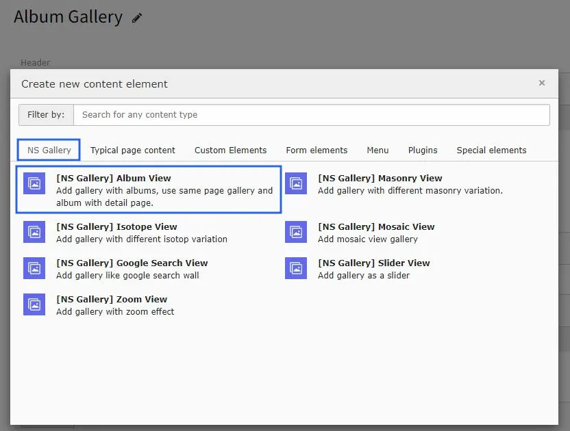
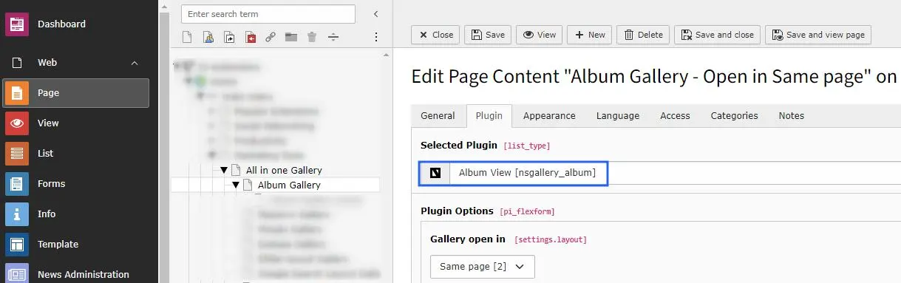
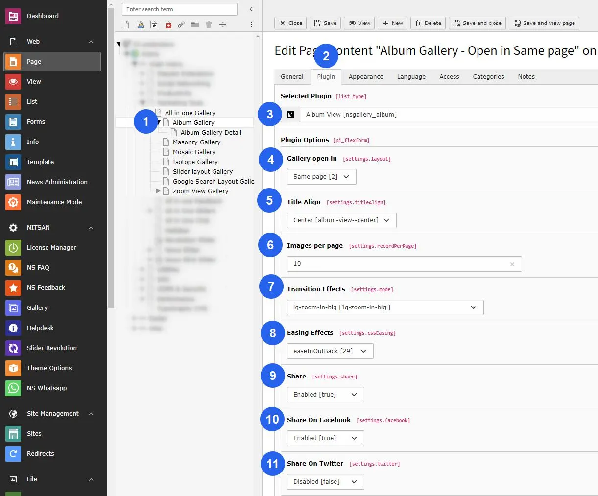
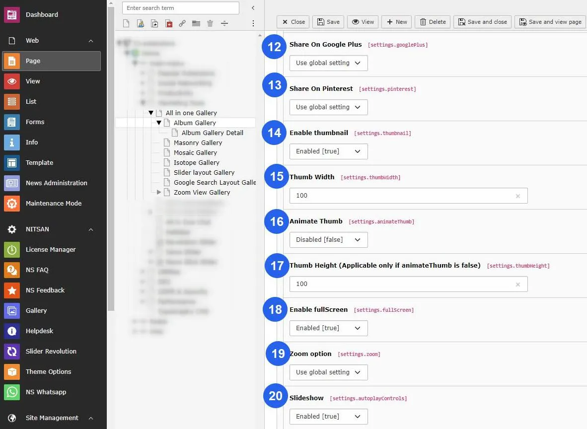
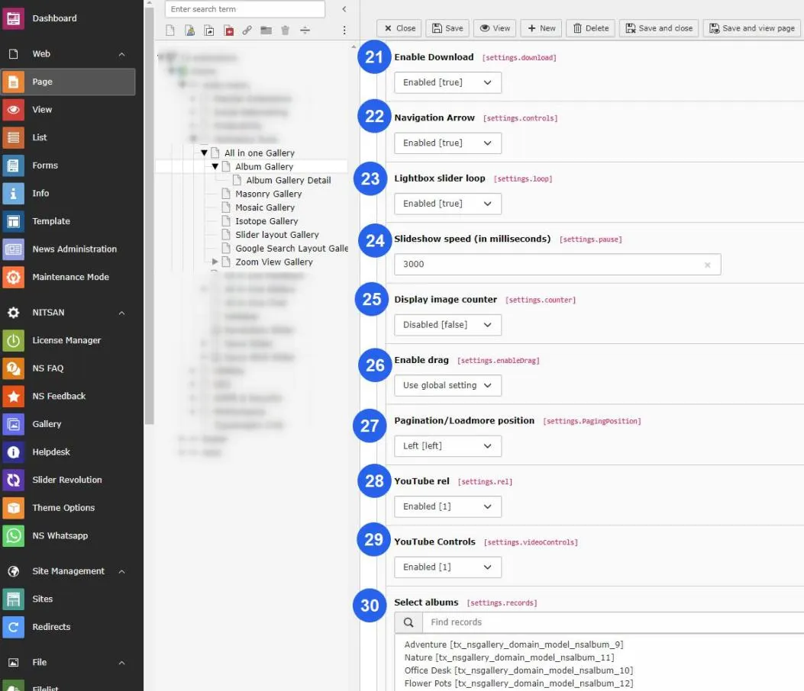
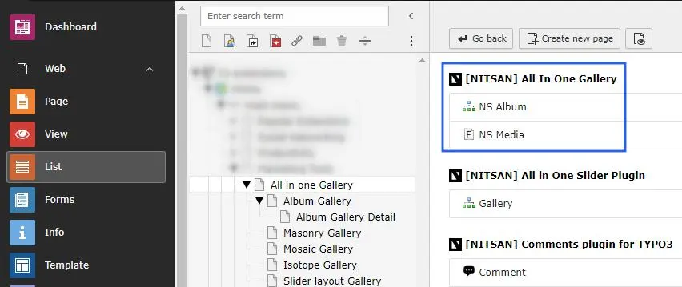

# Album View gallery

Setup album view gallery module.

Once you add the plugin, switch to Plugin tab to configure the gallery. Here, You can set Gallery specific configuration.

After setup album view plugin, you can see two options to open album view gallery either on Same Page OR on Detail page. setup gallery according to your website needs.

Now you can configure following settings on the album view gallery plugin on same page.

- Title Align : Setup alignment of the title in center/left alignment.
- Images per page : Insert the number of images you want to display on your gallery page.
- Transition Effect : Different types of transitions effect will present the progresses from one slide to the next.
- Easing Effect : You may apply different types of easing effect on the gallery images.
- Share : If this option enabled then social sharing apps like Facebook,Twitter, & Pinterest option will displayed. You can add particular social sharing option on your site by enable/disable that fields.
- Enable Thumbnail : You can setup Enable/Disable OR according to the global settings.
- Thumb Width : Insert the width of Thumbnails of the gallery image.
- Animate Thumb : If you need to animate the thumb then enable it otherwise disable OR setup according to the global settings.
- Thumb Height : Set Thumbnail's height, Its applicable only if animateThumb is disabled.
- Enable Full Screen : Enable this option if you want to display image in full screen otherwise setp accordingly global setting or disable it from plugin.
- Zoom options : You can enable/disable the zoom option of image.
- Slide Show : Enable this option for slide show of the image gallery.
- Enable Download : This will give user to allow download the image.
- Navigation Arrows : This will hide/unhide the navigation arrows of gallery image.
- Lightbox Slider Loop : This option will enable/disable the loop on slider view.
- Slideshow speed : Insert the speed of the slide show in millisecond.
- Display Image Counter : This will display the image counter on the gallery image if its enabled.
- Mouse Dragging : This option will facilitates the user to change the image by mouse dragging if its enabled.
- Pagination/Load more Position : Setup left/center alignment of pagination/loadmore position.
- Youtube rel : This options indicates whether the player should show related videos when playback of the initial video ends.
- Youtube Controls : Hide/Show the the youtube controls by this option.
- Select Albums : Finally choose the storage folder on where you have stored the images for your gallery.

