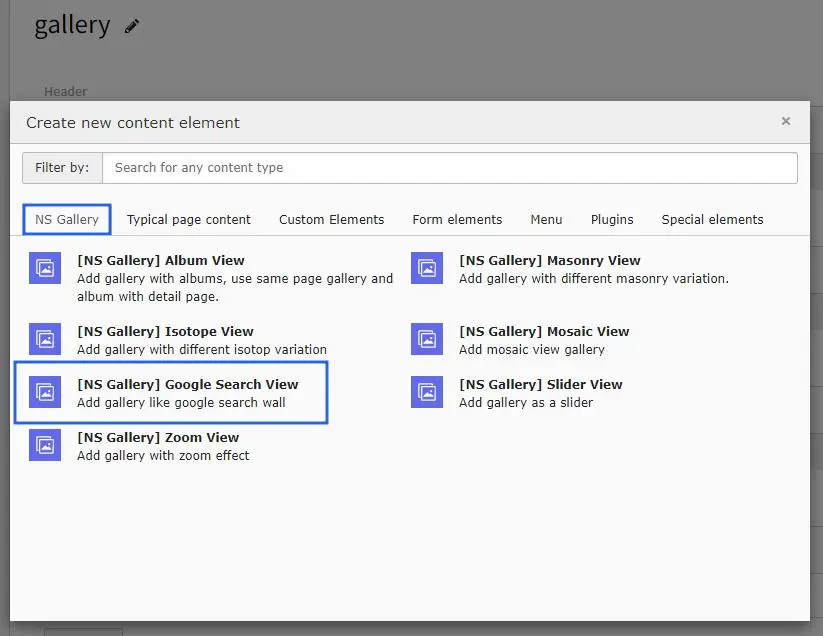
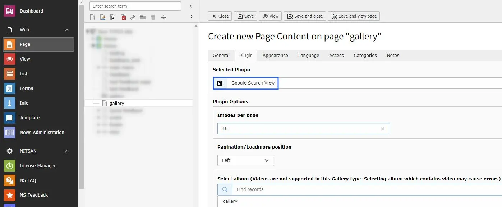

# Google Search View

Once you setup the Google Search View in the tab of Gallery module, you can use them in Gallery Plugins to display at your site.

Once you add the plugin, switch to Plugin tab to configure the gallery.

Configure following options for google search view plugin.

- Images per Page : Define how many images you want to show per page.
- Pagination/Load more position : Setup position of loadmore OR pagination.
