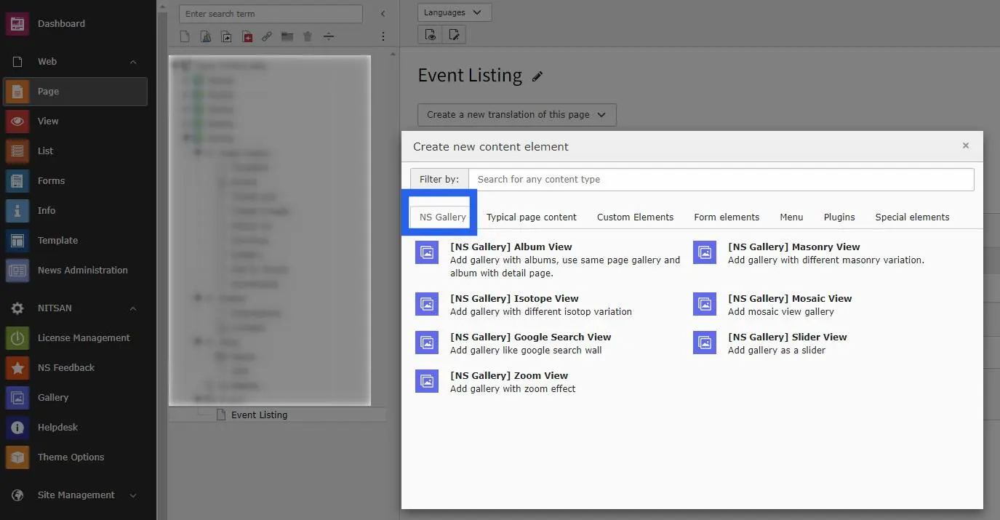
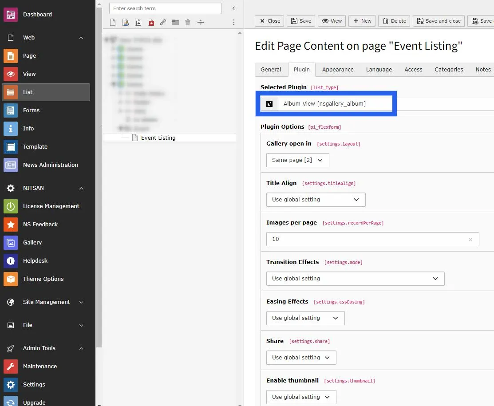

# How to setup & display gallery at website?

Once you setup the albums in Albums tab of Gallery module, you can use them in Gallery Plugins to display at your site. You will find a Plugin for each Gallery type in Create New Content Element wizard. Select the appropriate Gallery plugin from wizard.

Once you add the plugin, switch to Plugin tab to configure the gallery. Here, You can set Gallery specific configuration, Lightbox related configuration and albums to display in this gallery.

If the Gallery plugin you have selected supports Lightbox then you can configure following settings in the plugin.

- Transition Effect
- Easing Effect
- Sharing button
- Thumbnail
- Full Screen
- Zoom option
- Slide Show
- Slideshow speed
- Download
- Navigation Arrows
- Image Counter
- Mouse Dragging

## Figures

