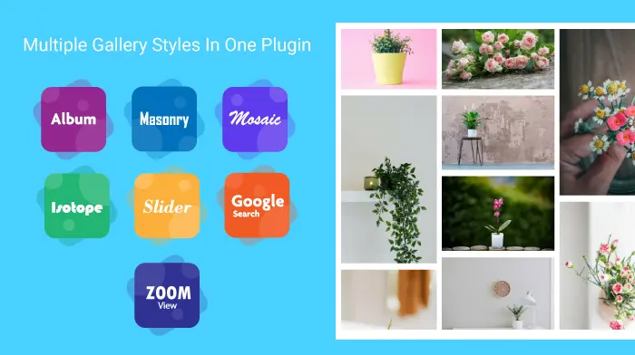
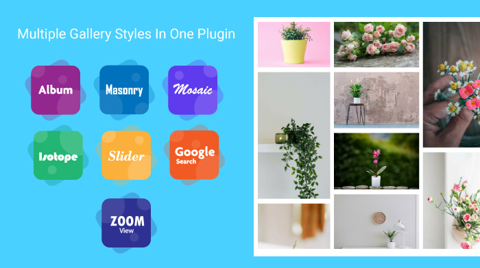

## NS Gallery

## What does it do?

EXT:ns_gallery is a TYPO3 extension which allows website Administrators to add beautiful Galleries to their website. EXT:ns_gallery provides variety of galleries to choose from and allow administrators to present media to website user in best possible way. Galleries in this extensions are not limited to just images and it also allow to add self-hosted Videos, YouTube Videos & Vimeo Videos.

Following Galleries are available with this extension:

**1. Album View (Open in same/new page)**

**2. Masonry View**

**3. Isotope View**

**4. Mosaic View**

**5. Slider View & Carousel View**

**6. Google Search View**

**7. Zoom View**

## Helpful Links

<Note>

- **Product:** https://t3planet.de/ns-gallery-typo3-extension
- **TYPO3 Backend Live Demo:** https://demo.t3terminal.com/live-typo3/t3t-extensions/typo3/?TYPO3_AUTOLOGIN_USER=editor-gallery
- **Front End Demo:** https://demo.t3planet.de//t3t-extensions/gallery
- To make any domain-related changes or whitelist any development and staging domains, please reach our support center: https://t3planet.de/support

</Note>

## Figures

