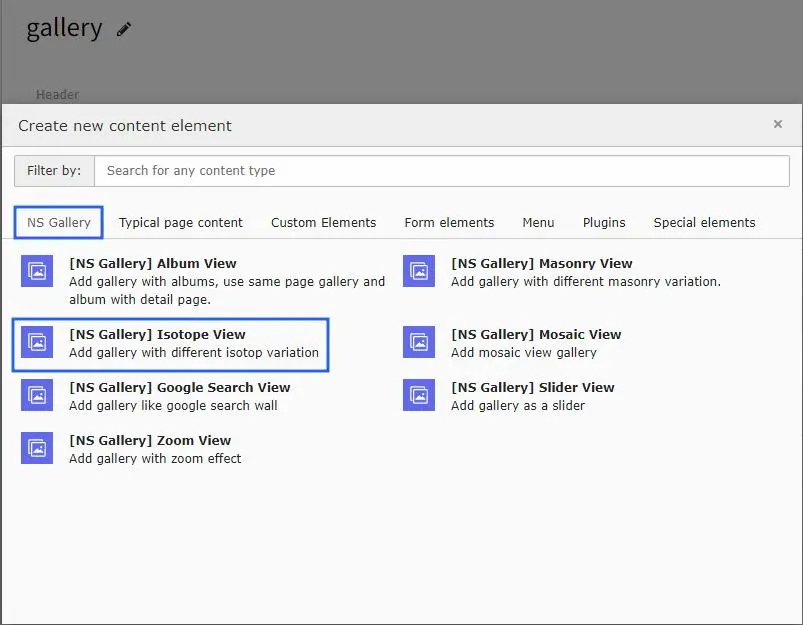
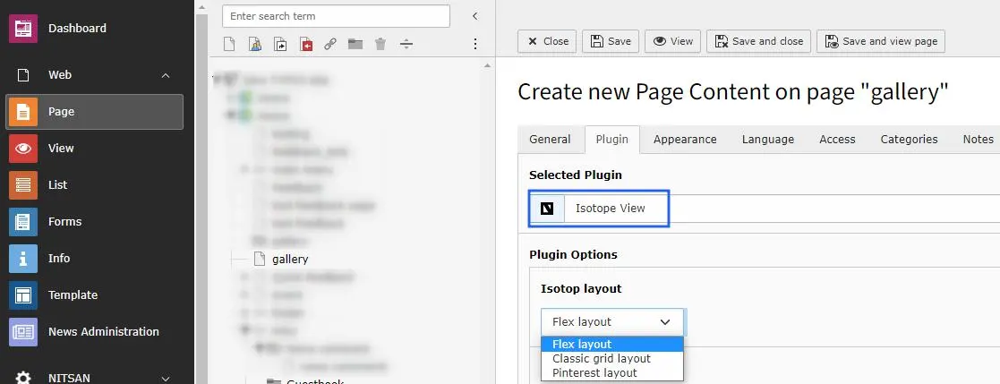

# Isotope gallery at website?

Once you setup the isotope gallery view in Gallery module, you can use them in Gallery Plugins to display at your site.

Once you add the plugin, switch to Plugin tab to configure the gallery. Here, You can set Gallery specific configuration.

Isotope view plugin has also 3 type of layout : Flex layout, Classic grid layout, & Pinterest layout. You can setup according to your website's need.!

<Note>

All the configuration options will be same as Album view gallery & self-explanatory. :)

</Note>
