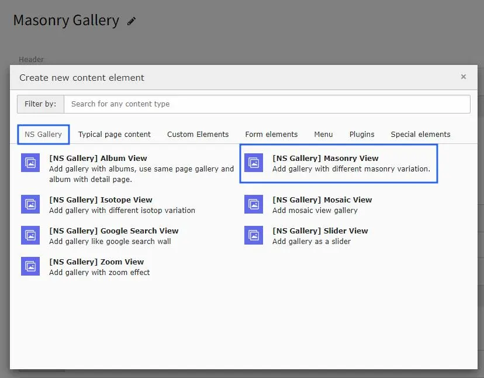
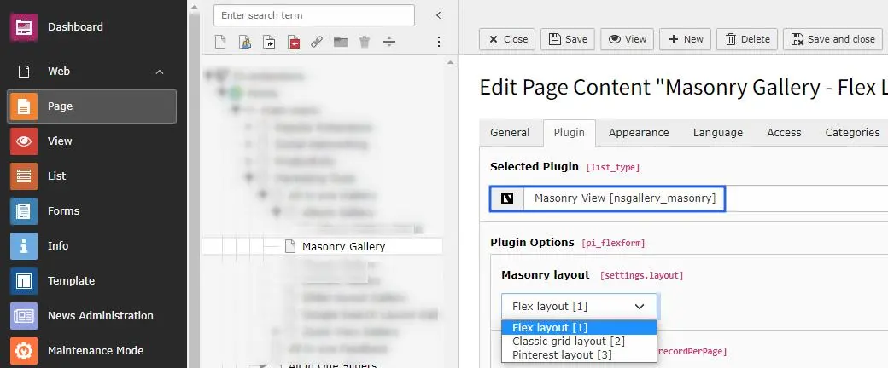

# Masonry gallery

Once you setup the Masonry view in Masonry tab of Gallery module, you can use them in Gallery Plugins to display at your site.

Once you add the plugin, switch to Plugin tab to configure the gallery. Here, You can set Gallery specific configuration, Lightbox related configuration and masonry layout to display in this gallery.

Masonry view plugin has 3 type of layout : Flex layout, Classic grid layout, & Pinterest layout. You can setup according to your website need.

<Note>

All the confiuration options will be same as Album view gallery & self explainatory. :)

</Note>
