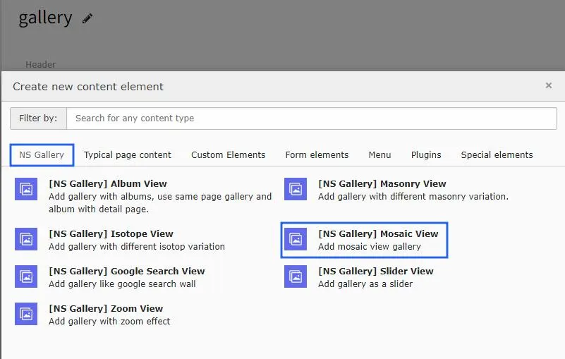
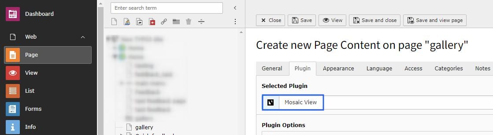

# Mosaic View gallery

Once you setup the mosaic view in tab of Gallery module, you can use them in Gallery Plugins to display at your site.

Once you add the plugin, switch to Plugin tab to configure the gallery. Here, You can set Gallery specific configuration, Lightbox related configuration and masonry layout to display in this gallery.

<Note>

All the configuration options will be same as Album view gallery & self-explanatory. :)

</Note>
