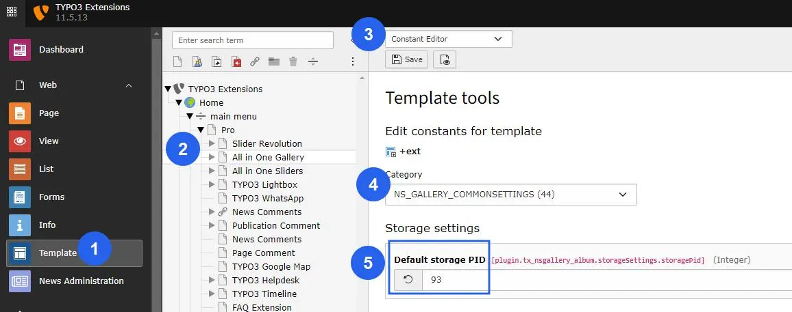
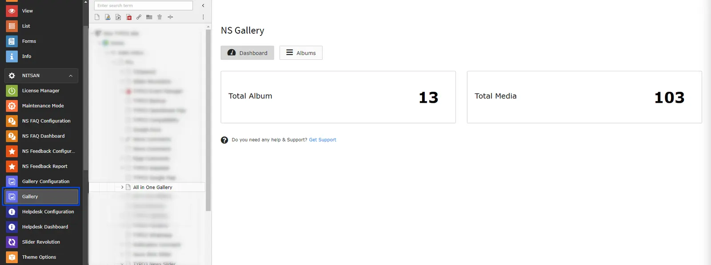
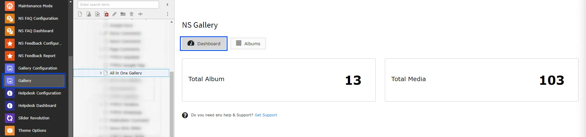
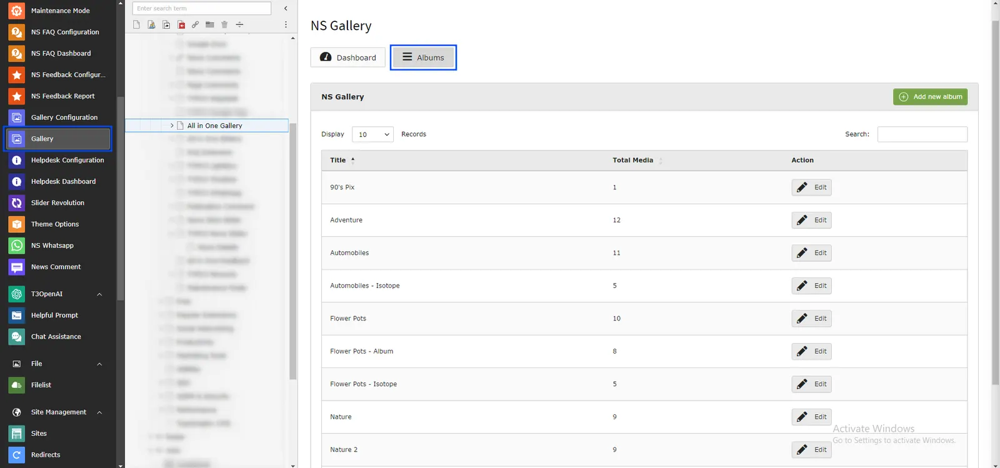
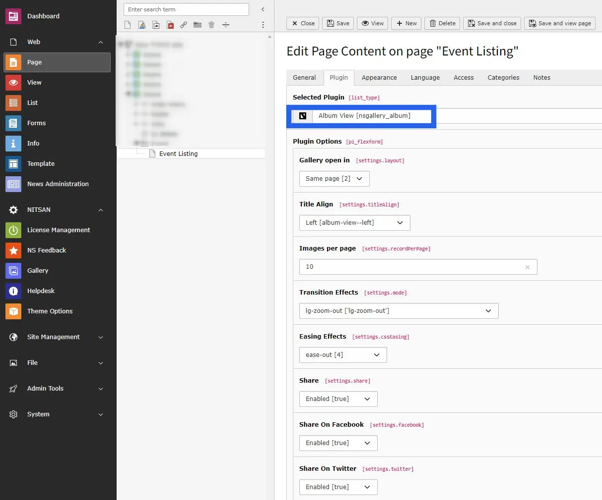
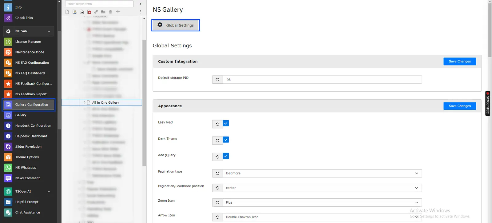

<Warning>

After Activation of gallery extension you must have to define the storage folder page id from constant editor. Refer below image please.!

</Warning>

Once you perform installation process successfully, you will find a new Backend modules "Gallery and Gallery Configuration" under "Nitsan" group in Sidebar. This modules will be used for all the configuration of all Galleries in your site. This Modules provides complete management of Galleries.

This Module contains various tabs for all kind of Galleries Configurations. Let's understand how each tab works one by one.

## Gallery

## Dashboard

This is the first tab in NS Gallery Module and as name suggest, it shows dashboard of complete module. It highlights total number of albums created at the currently selected page. It also displays how many Images/Media are created and used in various albums.

## Albums

This tab allows administrator to create albums. Albums are collection of Media (Images & Videos). User can add and edit albums from this tab.

To add a new album, click on "Add new album" button. It will open a Album Record where you can add Media in album. You can set Album Title and add all Images/Videos as individual Media in Album Record.

Once Album is created, you just need to select the album in Gallery plugin.

## Gallery Configuration

### Global Settings

This module is used to configure Global Settings for the Gallery extension. Here you can set configuration for appearance of Gallery, What to show in Lightbox and also settings for Slider, Carousel & YouTube Videos related settings.

