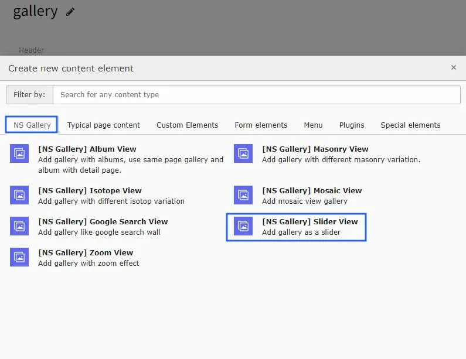
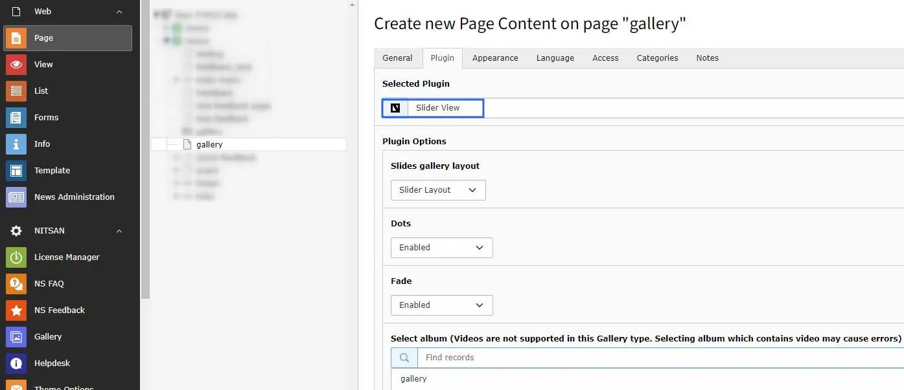

# Slider View gallery

Once you setup the slider view in tab of Gallery module, you can use them in Gallery Plugins to display at your site.

Once you add the plugin, switch to Plugin tab to configure the gallery.

Slider View plugin has 2 types of layout : Slider Layout & Carousel Layout.

Following options are available in slider view layout.

- Dots : Enable this option to add the dots on image slider gallery.
- Fade : Enable this option to apply the fade effect on slider view gallery.

Following options are available in Carousel Layout.

- Dots : Enable this option to add the dots on image slider gallery.
- Focus On Select : You may enable / disable this option.
- Arrows : This option will provide to hide/show the arrow icon on slider view gallery/
- Touch Move : If this enabled it will enable the touch event on devices.
- Select Storage folder.
