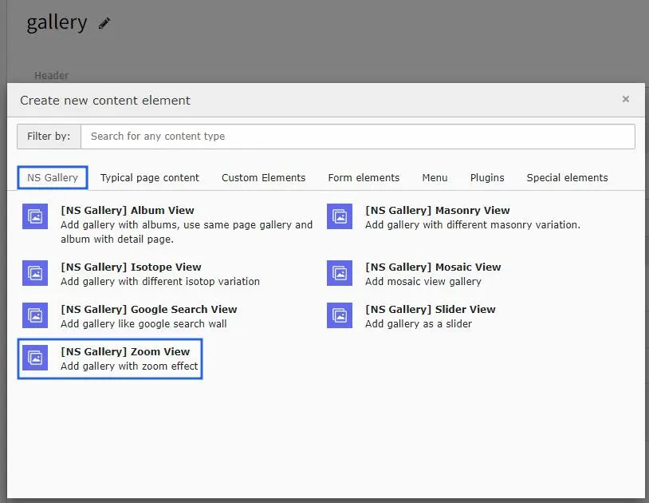
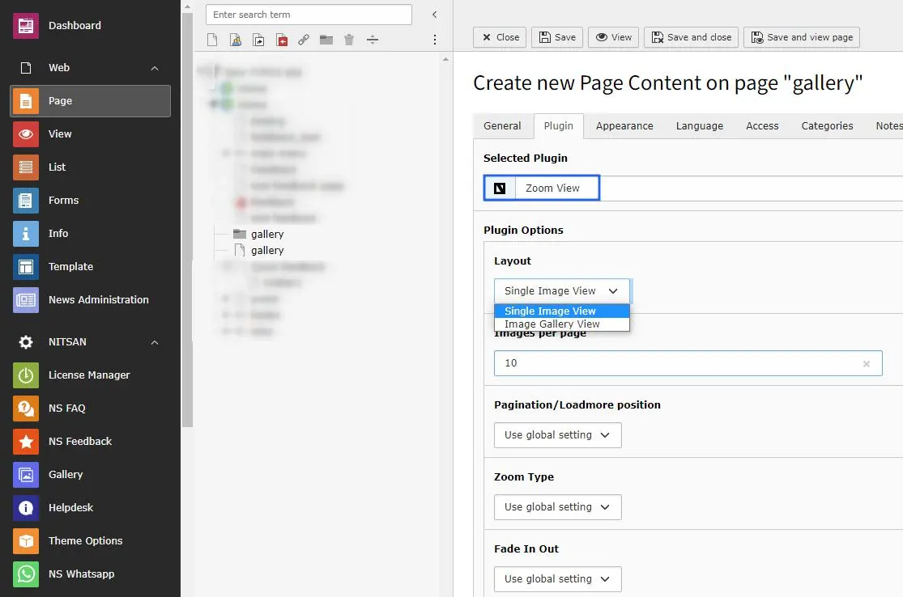

# Zoom View

Once you setup the Zoom View Gallery module, you can use them in Gallery Plugins to display at your site.

Once you add the plugin, switch to Plugin tab to configure the Zoom View gallery.

Zoom View gallery plugin has 2 variations : Single image view & Image Gallery View.

<Note>

All the configuration options will be same as Album view gallery & self-explanatory. :)

</Note>
