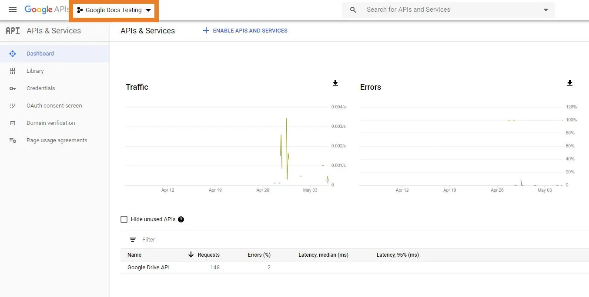
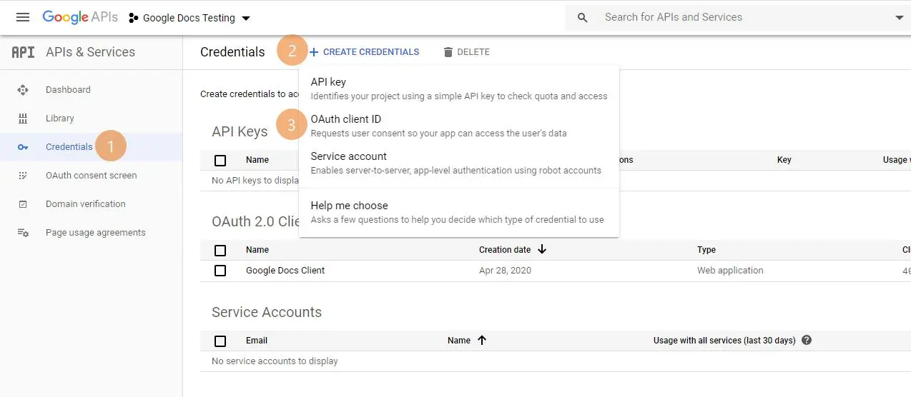
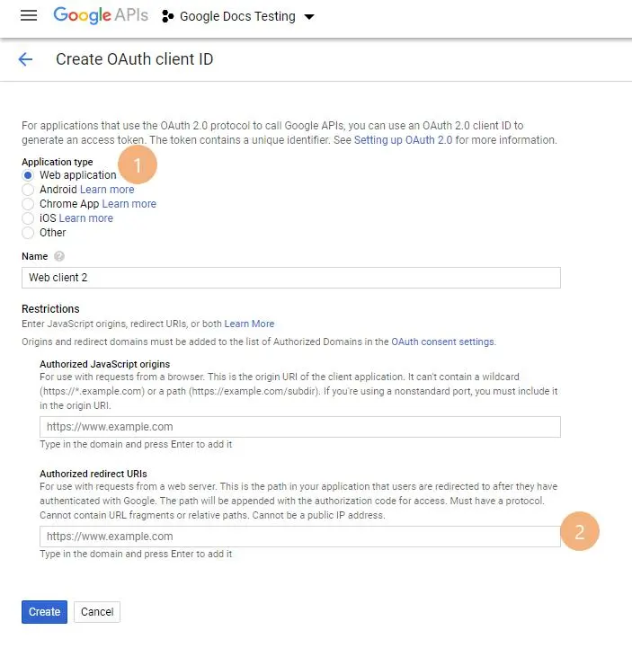
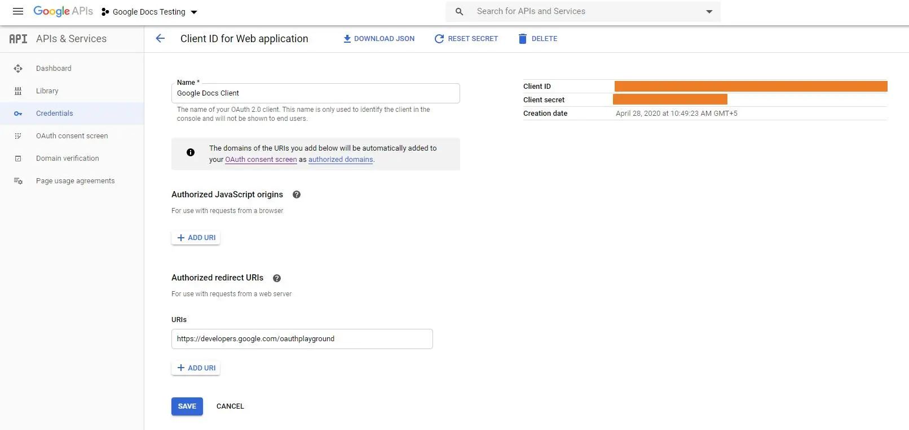
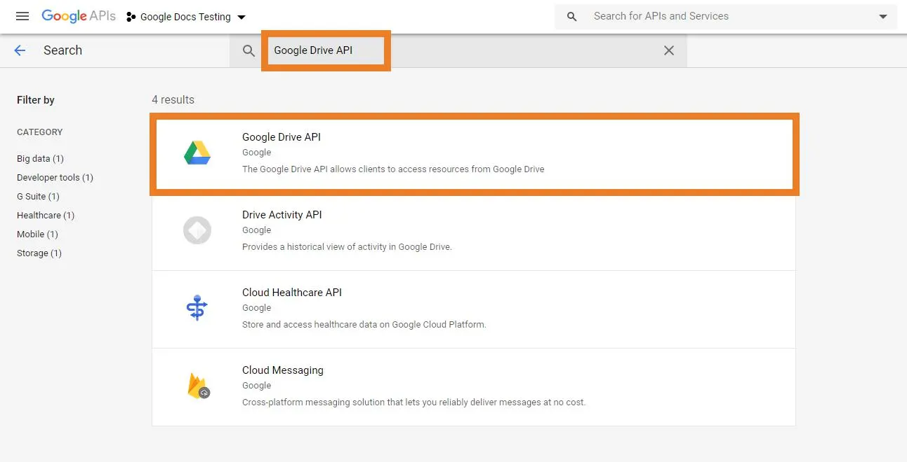
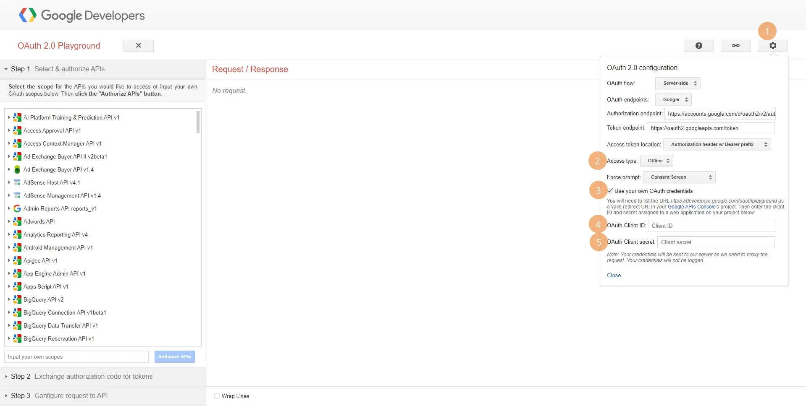
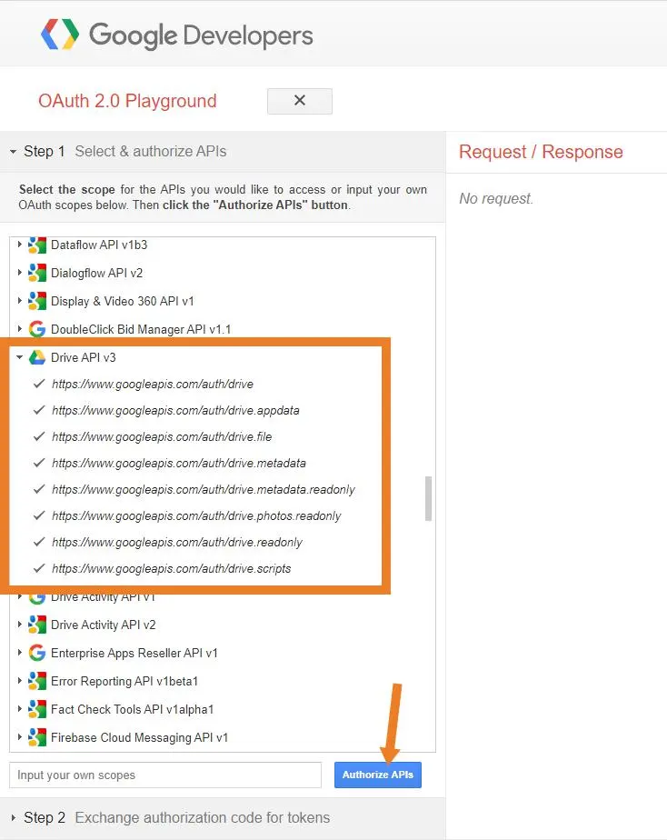
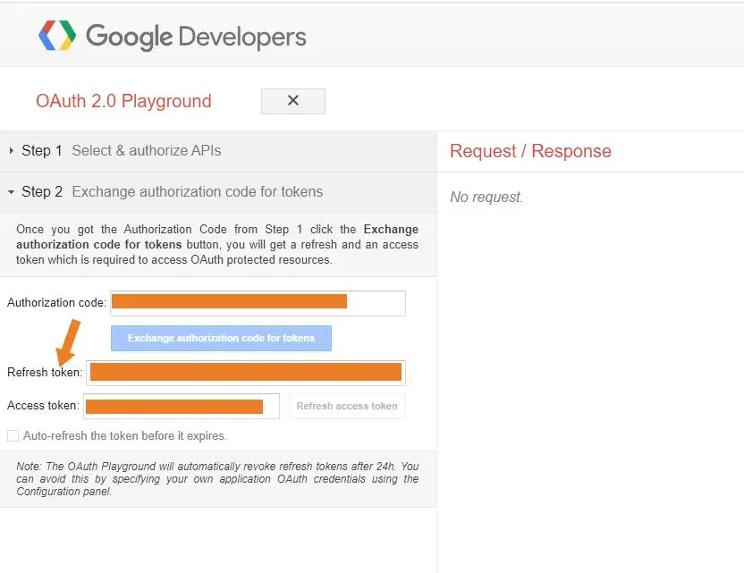

Before you can start using EXT:ns_googledocs, You need to get Google Client ID, Secret Key and Refresh Token for your Gmail account. These details will help to fetch Google Docs from your Gmail account.

1. To Create Google Client ID and Secret Key go to https://console.developers.google.com
2. Create a New Project or select existing project.

3. Switch to Credentials. Click on Create Credentials button and Select OAuth Client ID

4. Select "Web Application" option and set Authorized redirect URIs "https://developers.google.com/oauthplayground"

5. This will generate Client ID and Client Secret Key.

6. Switch to Library and search for "Google Drive API". Select API and enable it.

7. Now go to https://developers.google.com/oauthplayground/
8. Set your Client ID and Secret Key in Settings

9. Go to Step 1 section. Search & expand Drive API v3. Select all options and click on Authorize APIs button.

10. Now, go to Step 2 and there you can find your Refresh token.

Once you complete these steps, you will have Google Client ID, Secret Key and Refresh Token for your account. You have to set those in Global Settings of EXT:ns_googledocs.
