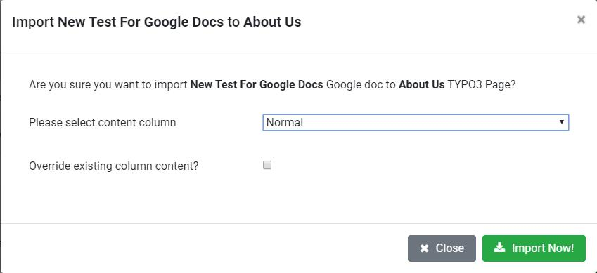

Once all the Global Settings are configured properly, you are ready to import Google Docs to your TYPO3 pages or Blog or News.

To import Google Doc to TYPO3 Page/Blog/NEWS, perform following steps:

1. Select the Page/Blog/News Folder where Google Doc should be imported.
2. Then switch to NS Google Docs Module and go to Import Google Docs tab.

3. Select the Google Doc to import. You can use searchbox at top-right to find the correct Google Doc.
4. Click on Import Now button. It will open following pop-up

5. Select the Content Column from drop-down. This drop-down will list all the columns available in selected TYPO3 page and Google Doc content will be imported in this column. If you have selected News folder then it will ask you to confirm to import doc to News record.
6. If you want to override existing content elements of selected column before importing Google Doc, check the checkbox. If it is not checked then it will append new Content elements created from Google import.
7. Click on Import Now button to start import. once it is clicked, It will display progress bar of import. Once imported successfully, it will display confirmation message at top-right.

Switch to Reports & Logs tab to access the Imported Page/Blog. If you have selected News then News record will created in selected folder. By default, News record will be disabled and you'll need to enable it.
