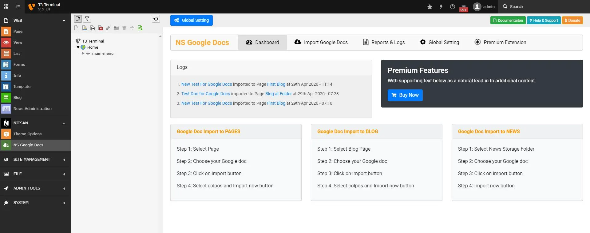
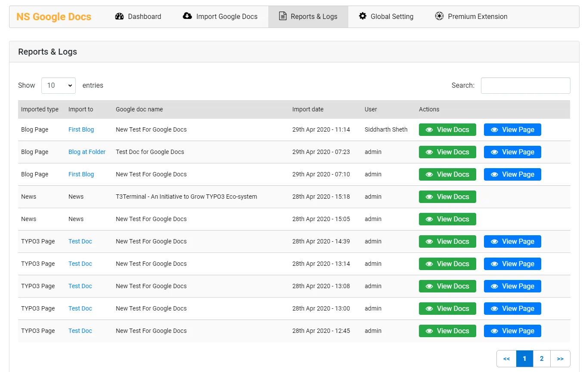
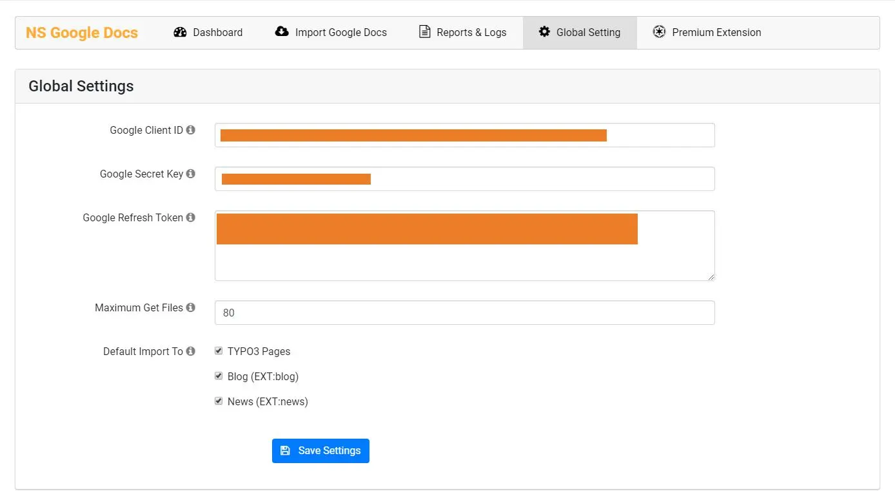

## NS Googledocs

## What does it do?

EXT:ns_googledocs is the only TYPO3 extension which allows Backend user to import Google Docs to TYPO3 and convert the Google Docs content into TYPO3 Content elements.

**FEATURES:**

## Screenshots

### Backend Screenshots

**Dashboard**

**Import Google Docs**

**Reports & Logs**

**Global Settings**

## Helpful Links

<Note>

- **Product:** https://t3planet.de/ns-google-docs-typo3-extension
- **Front End Demo:** https://demo.t3planet.de//t3t-extensions/googledocs
- To make any domain-related changes or whitelist any development and staging domains, please reach our support center: https://t3planet.de/support

</Note>

## Figures

