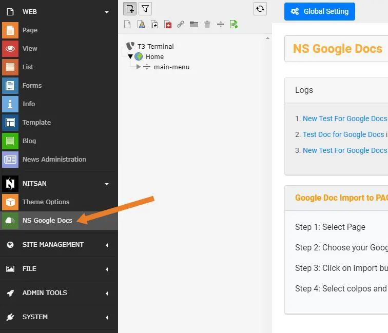
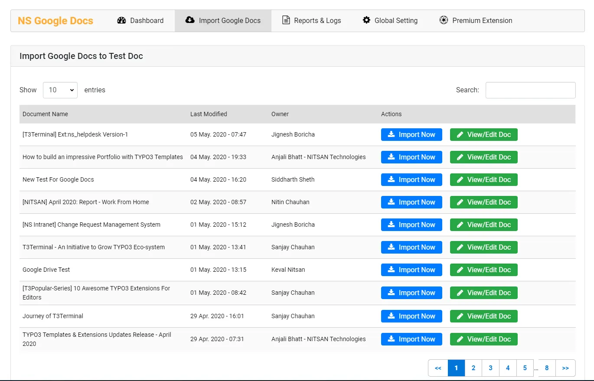
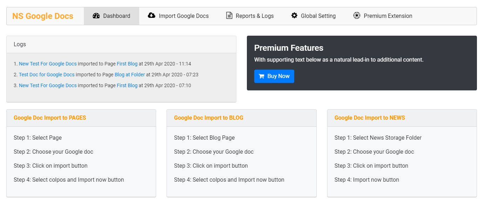
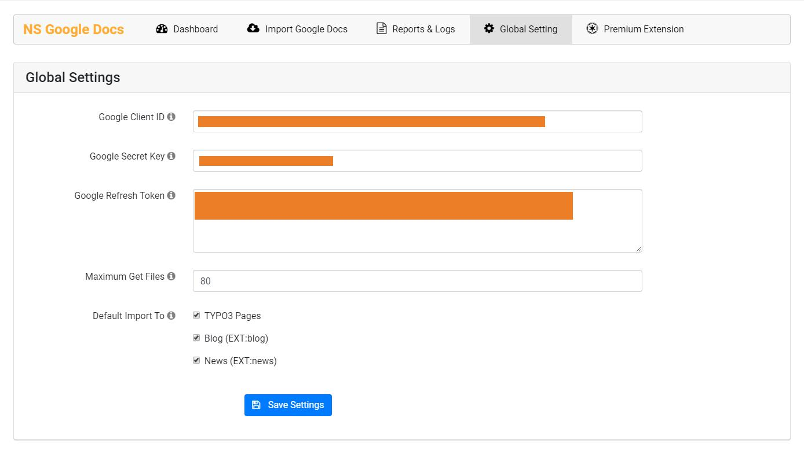

Once you install the extension successfully, you will find a new Backend module for Google Docs in Sidebar. This module will be used for all the configuration of Google Docs. This Module provides complete management of Google Docs.

This Module contains 5 different tabs for all kind of Google Docs Configurations. Let's understand how each tab works one by one.

## Dashboard

This is the first tab in NS Google Docs Module and as name suggest, it shows dashboard of complete module. It highlights Logs of imported Google Docs to TYPO3 pages. It also allows user to access those Google Docs and TYPO3 pages from Dashboard itself. It also defines how to import Google Docs to TYPO3 Page, Blog and NEWS.

## Global Setting

You need to set Global settings first to use any of the features of this extension.

- **Google Client ID** - Set Google Client ID you generated earlier.
- **Google Secret Key** - Set Google Secret Key you generated earlier.
- **Google Refresh Token** - Set Google Refresh Token you generated earlier.
- **Maximum Get Files** - Here you can set how many Google Docs needs to be fetched from your Gmail account. You can change it anytime.
- **Default Import To** - Here you can set permission for Google Docs to be imported. You can select Page, Blog and NEWS individually or all together.

Once all the settings are set, click on Save Settings button.

<Note>

To verify that Settings are configured properly, Switch to Import Google Docs tab. If this tab lists Google Docs from your configured Gmail account then settings are done properly.

</Note>

## Import Google Docs

This tab is used to import Google Docs to TYPO3 Page/Blog/NEWS. This tab lists all the Google Docs available. User can select the Google Docs and import it to selected TYPO3 Page/Blog/NEWS. It also allows user to search from all Google Docs and how many Docs to display in single page.

## Reports & Logs

This tab lists complete logs of all the Google Docs imports have taken place in the system. It will display which Google Doc is imported to which TYPO3 Page/Blog/News with Import time, importer name. It will also allow user to access the Google Docs and imported Page/Blog from this tab directly.

## Figures

