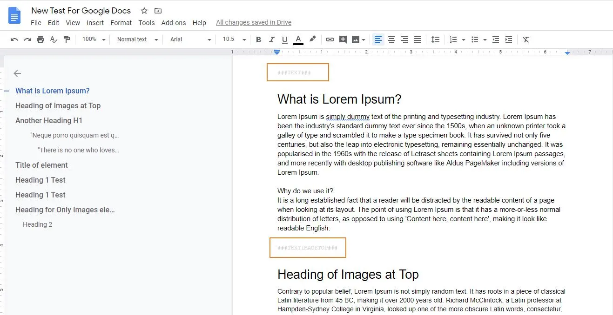

To generate various Content elements from Google Doc content, we have used Markers features of Google Doc. Markers allows to identify the content type and based on these markers, we can generate various Content elements.

Following markers are supported:

###TEXT###

###TEXTIMAGETOP###

###TEXTIMAGELEFT###

###TEXTIMAGERIGHT###

###TEXTIMAGEBOTTOM###

###IMAGES###

Content added after any of the markers and before starting of any of the marker will be added in single content element

1. ###TEXT### :- This marker will create content inside this marker as Text/RTE element.
2. ###TEXTIMAGETOP### :- This marker will create content inside this marker as Text & Images element. You can also select the Image position and alignment from marker. You can set it to Top, Left, Right and Bottom. You just haver to update this in Marker text.
3. ###IMAGES### :- This marker will create content inside this marker as Images Only element.

<Tip>

If you set any text as Heading 1 style immediately after marker, that text will be set in header field of the Content element.

</Tip>
