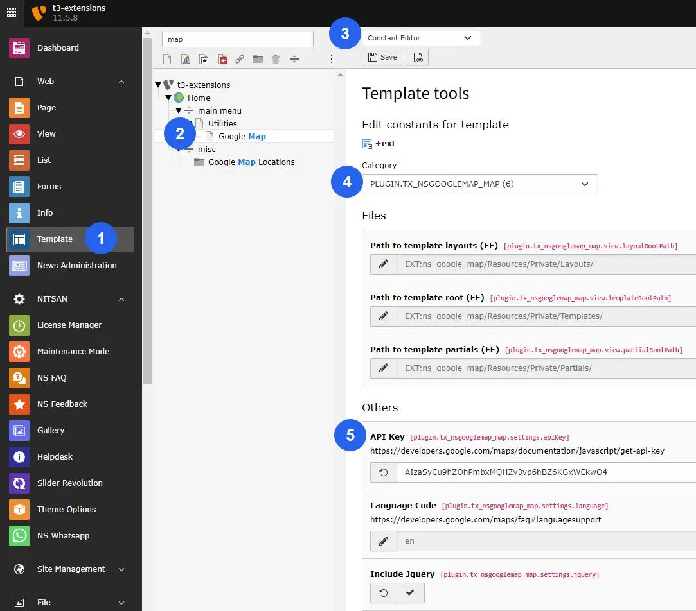

First of all, you need to add Google Map API.

You can do it by performing following steps:

Step 1: Go to TYPO3 Template Module > Select the page in which you want to configure the Google Map Extension.

Step 2: Go to the Constant Editor.

Step 3: Choose Google Map plugin from the Category dropdown box.

Step 4: Now, add Google Map API key on the "Others" Setting.

Now you can Save the changes & use it on your awesome website.!
