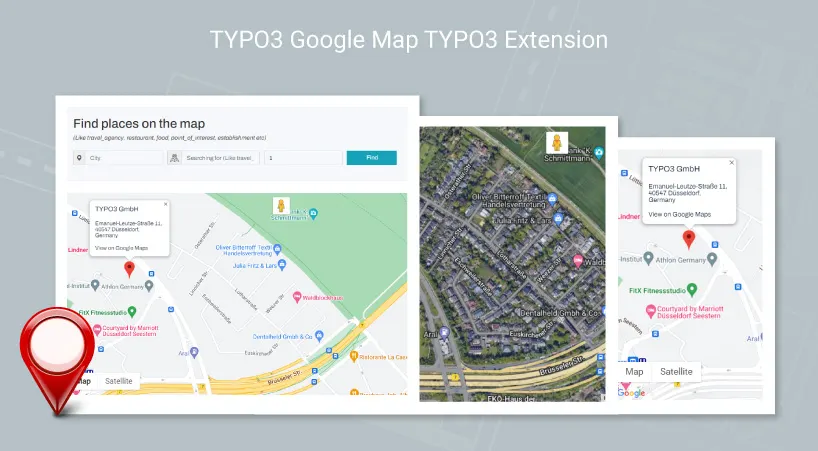

## NS Google Map

## What does it do?

The easiest to use Google maps plugin! Add a customized Google map to your TYPO3 website quickly and easily with the NS Google Map. Perfect for contact page maps, routes, maps, restaurants, hospitals areas and any other use you can think of!
Google Maps allows you to create a Google map with as many markers as you like.

## Helpful Links

<Note>

- **Product:** https://t3planet.de/typo3-google-map-typo3-extension-pro
- **TYPO3 Backend Live Demo:** https://demo.t3planet.de/live-typo3/t3t-extensions/typo3/?TYPO3_AUTOLOGIN_USER=editor-google-map
- **Front End Demo:** https://demo.t3planet.de//t3t-extensions/google-map
- To make any domain-related changes or whitelist any development and staging domains, please reach our support center: https://t3planet.de/support

</Note>
