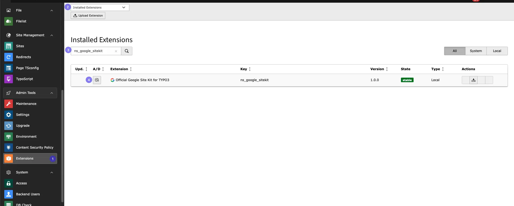
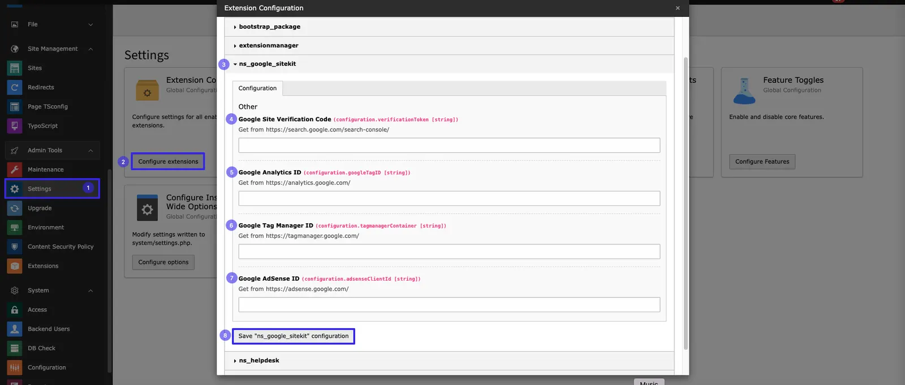

<Note>

The free version does not include the TYPO3 backend module. It only provides the frontend meta-data script, which should be configured in the Settings module.

</Note>

## Install Free version

You can efficiently utilise the extension manager.

- **Step 1:** Navigate to the “Extension Manager” module.
- **Step 2:** Select “Get the extension” from the dropdown menu.
- **Step 3:** Search with the Extension Key “ns_google_sitekit”
- **Step 4:** Click the ” Retrieve/Update ” Button to Import the Extension From the repository.

Download the Latest Version from typo3.org: https://extensions.typo3.org/extension/ns_google_sitekit by downloading the t3x or zip version. Upload the file afterwards in the Extension Manager.

## Configure Google Meta-data

After installing the free version of the extension, you need to configure IDs for the Google site key in the settings.

Follow below steps to configure it!

- **Step 1:** Go to **Settings** module
- **Step 2:** Click on **Configure Extensions**
- **Step 3:** Select **ns_google_sitekit**
- **Step 4:** Add **Google Site Verification code**
- **Step 5:** Add **Google Analytics ID**
- **Step 6:** Add **Google Tag Manager ID**
- **Step 7:** Add **Google Adsense ID**
- **Step 8:** Save configurtion by clicking **Save "ns_google_sitekit" configuration**

You Can Generate all this Code and ID from the [Google Site verification code](https://search.google.com/search-console/), [Google Analytics ID](https://analytics.google.com/), [Google Tag Manager ID](https://tagmanager.google.com/) and [Google Adsense ID](https://adsense.google.com/).
