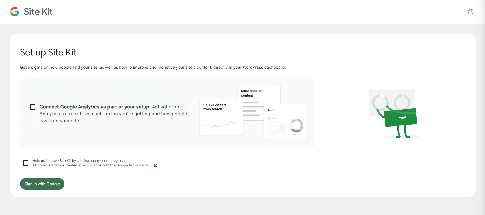
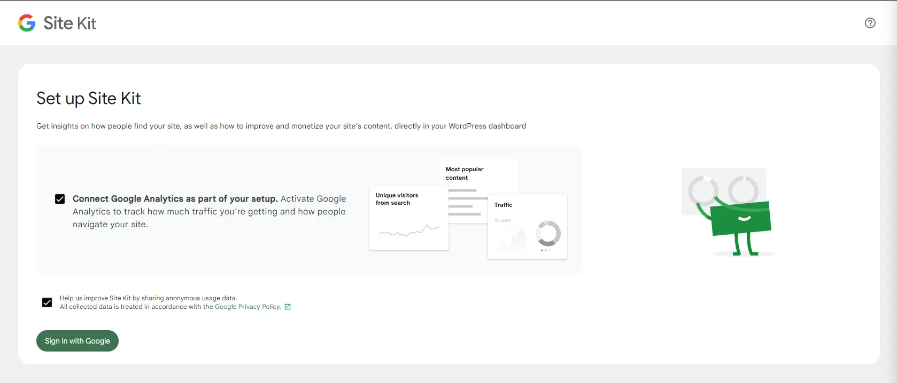
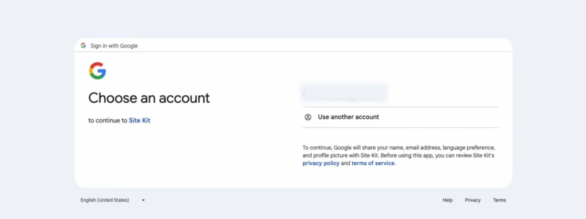
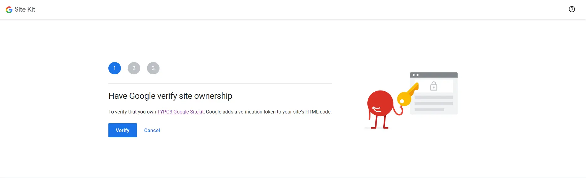
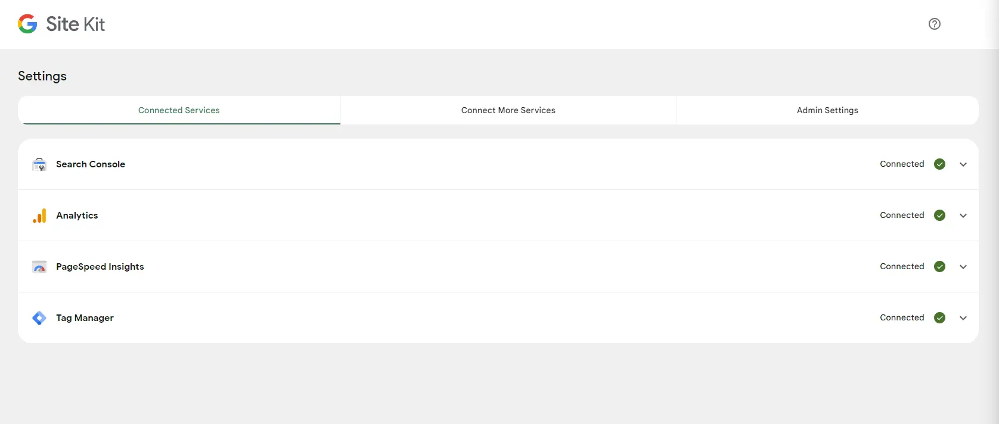
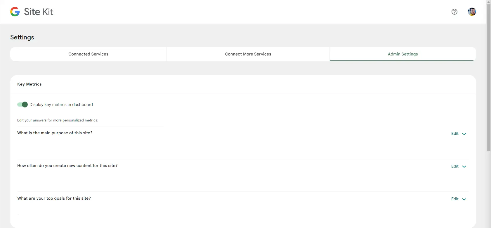

First, you need to install our TYPO3 Google Site Kit plugin. You can add it using Composer or by uploading the ZIP file directly.

Then, You Need to perform the following steps to integrate the site kit with TYPO3.

- **Step 1:** Go to > **TYPO3 Backend > Dashboard**

- **Step 2:** Click on **Sign in With Google option**

- **Step 3:** Choose the Google account you want to link, then click **'Next'.**

- **Step 4:** Verify your account to integrate Google Site Kit after signing in. Simply follow these steps: click **Step 1,2,3**, then 'Next', and that’s it. Your account is verified.

- **Step 5:** Simply click on **go to my dashboard**

# Google Site Kit setting

After integrating the Google Site Kit on your TYPO3 backend, go to the Google Site Kit module and click on Site Kit Settings.

## Connected Service

Connect your Google tools with Site Kit by adding the code and script. Google Site Kit will handle the rest.

**You can connect your google tools like:**

- **Google Search Console:** This is for better measuring your web traffic, performance, and web issues, helping you rank well on Google with a comprehensive overview.
- **Google Analytics:** This is for tracking users and providing an overview of your website.
- **Google AdSense:** allows you to view your ad earnings and page-level click-through rates (CTR) and analyse your website's performance on a page-by-page basis with customisable filter options.
- **Google Ads:** Track conversions for your existing Google Ads campaigns
- **Page speed insights:** This will give you the total load time, factors affecting performance, and suggestions for reducing your site's load time.

## Admin Settings

You have the power to manage critical metrics, monitor plugin status, and configure various options to optimise your website's performance. Here are some of the features you can access:

- **Set Key Metrics:** Choose and prioritise your most important metrics in your dashboard for easy monitoring.
- **Monitor Plugin Status:** Monitor the status of all integrated plugins to ensure they are running smoothly and update them as needed.
- **Customizable Dashboard:** Personalise your dashboard to display the information that matters most to you, making it easier to manage your website.
- **Tracking:** Help us improve the Site Kit by sharing anonymous usage data.
