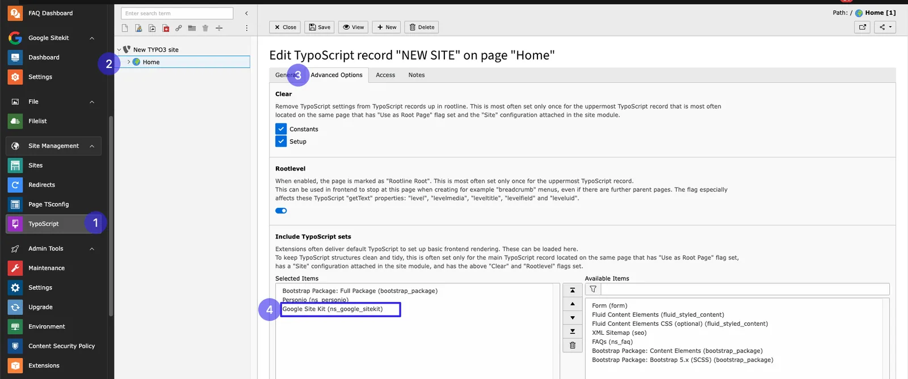

# Installation

Simply install this extension just like any other TYPO3 extension.

## For Premium Version - License Activation

Activate your license and install the premium TYPO3 product:

- **Step 1:** Purchase the extension from the provided link. Then, log in to your TYPO3 backend and go to the "Extension Manager" module.
- **Step 2:** Choose "Get the extension" from the dropdown menu.
- **Step 3:** Search for the extension key "ns_license" and install the license manager. Enter the license key you received in your email.
- **Step 4:** Install "ns_google_sitekit" just like you did with the license manager. Click "Retrieve/update" to import the extension from the repository. For detailed instructions, see the documentation at [License documentation](/License/Index)

<Warning>

For TYPO3 >= v11 composer-based TYPO3 instance, Please don't forget to run below commands.

</Warning>

```python
vendor/bin/typo3 extension:setup
vendor/bin/typo3 nsgooglesitekit:setup
```

## Activate the TypoScript

The extension includes some static typoscript code that needs to be added.

Step 1. Go to the template module and choose info/modify.

Step 2. Select the root page of your site.

Step 3. Click & edit the template record and go to the includes tab.

Step 4. In the include Typoscript sets (from extensions) field, select Google site kit (ns_google_sitekit).



## How to Install TYPO3 Extension ns_google_sitekit

**Extension Installation Via without Composer mode**
https://www.youtube.com/watch?v=SN5HoFQcDM4

**Extension Via Composer**
https://www.youtube.com/watch?v=_7ILu4lwU-k
