# Configuration

## Preconditions for Migration:

We assume you have EXT:grid elements and EXT:container Extension.For migration you must set Container Configuration same as Grid Configuration !

When you make the container configuration then some points are strict to follow for migration process
**Container CType** and Old Gridelements **tx_gridelements_backend_layout** the key must be the same.

**For Example :** I need to migrate the Grid of **"nsBase1Col"** then while in container configuration, you need to put container's CType as **"nsBase1Col"**

### Grid Backend Layout Key

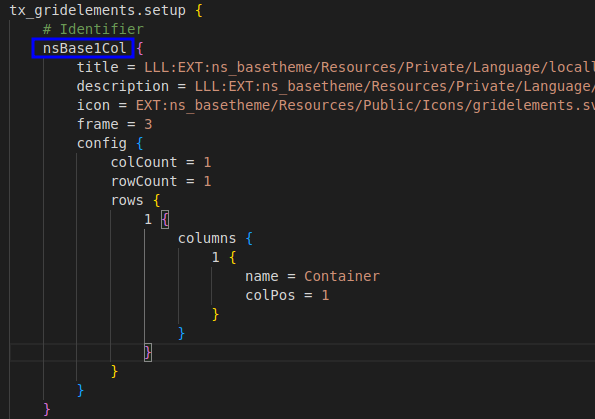

### Container CType

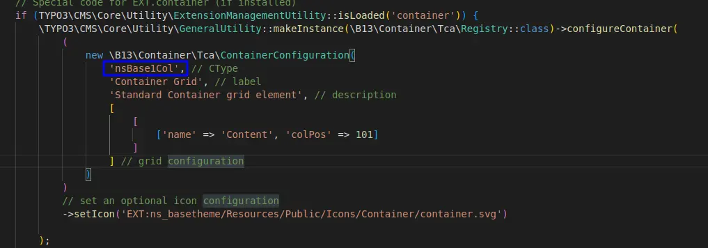

**For colPos > Grid colPos:** For example, the Grid's Colpos is '1' then while in container configuration you need to put colPos higher than Grid. like '101'
Because In migration process, we make the same container's colpos with which comes of grid's colPos for the placing Content Elements of Grid in Container while migrating.
Like. Grid ColPos\*\* '1'[tx_gridelements_columns] and in container configuration, colPos is '101'\*\*

Then in migrating process, we make same colPos for placing Content Elements \$colPos = \$element['tx_gridelements_columns'] + 100;"

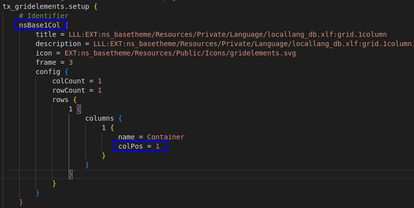

While container colPos must be different like
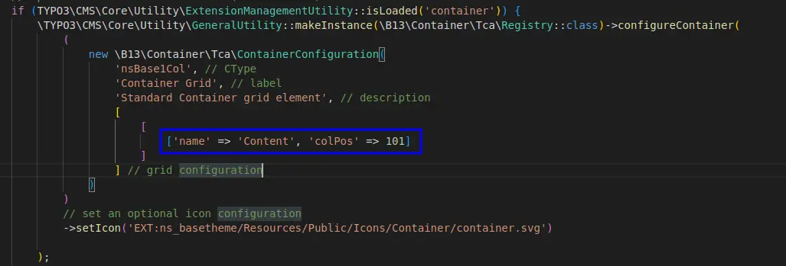

## We provide 2 options for migrating grids

**Option 1:Migration of all Grids available on the site.**
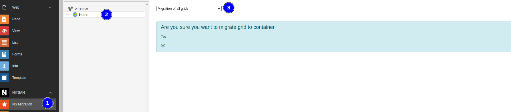

**Option 2:If you have a small number of grids then you can use the second option "Migration from grid elements layout key"**
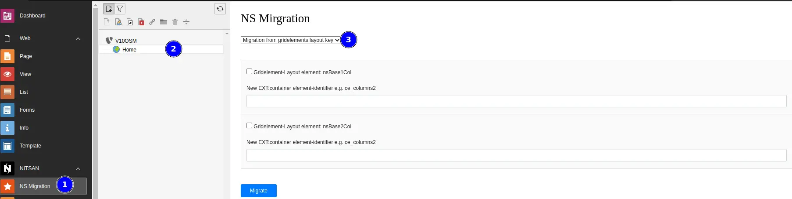

## Migration Process:

**Grid:** For example You want to migrat this gird
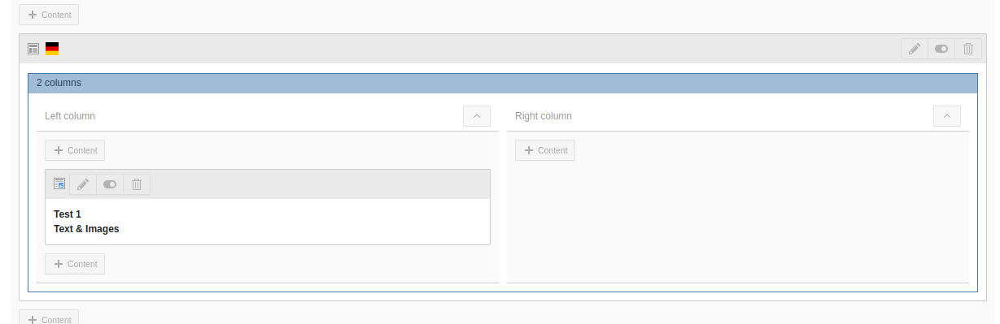

**Follow this Steps>>**

**Step 1:** Enter container CType with same as Grid Backend Layout Key

**Step 2:** Click on "Migrate Button" It will show message like "Successfully migrated"
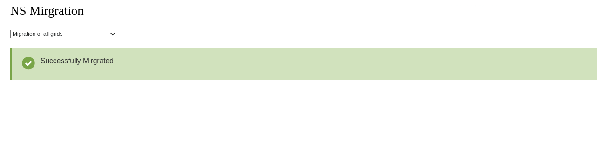

**Step 3:** Now, check the migration!
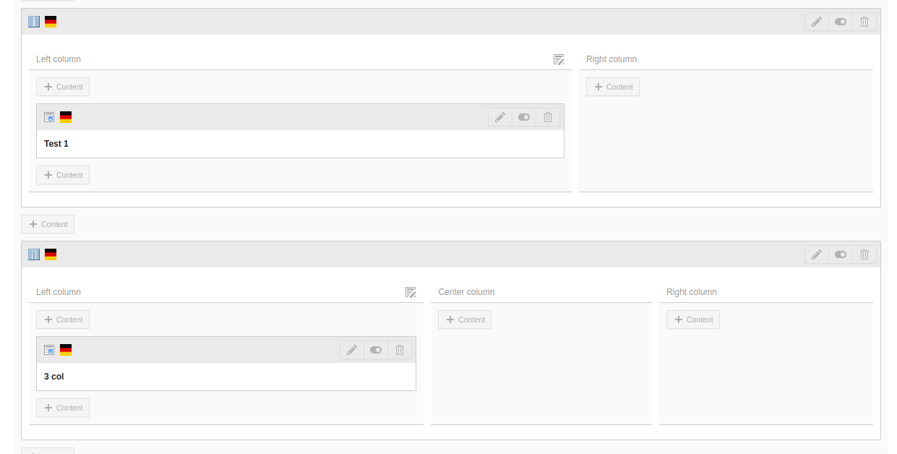

**This Extension also Provide feature to migrate Hidden content Elements!**
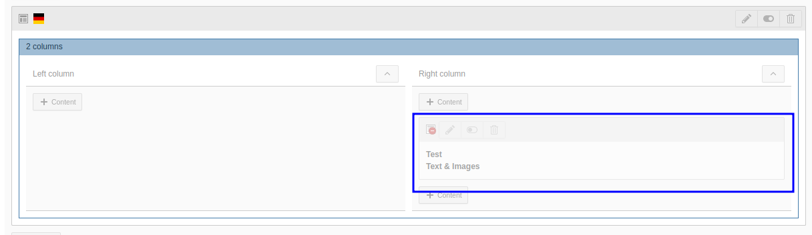

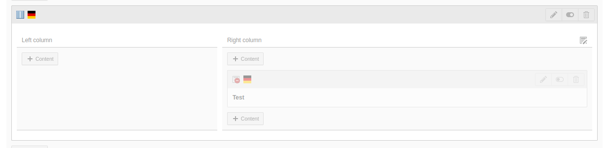

**That's it, Now you can enjoy all the benifits of this extension :)**
