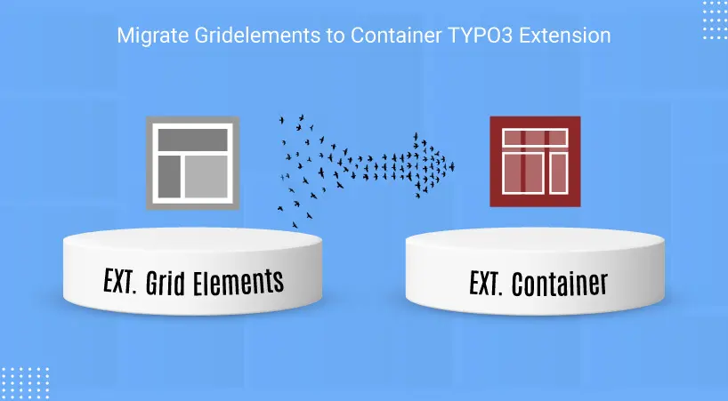

## NS Gridtocontainer

## What does it do?

EXT:ns_gridtocontainer is a migration extension providing a Backend module for those who want to switch from EXT: Gridelements to EXT:container.

## Features

- 100% for TYPO3 Developers & Integrators
- This Extension provides a backend module for the migration of grids to container
- lso Mirgrating hidden content elements of Grid.

## Helpful Links

<Note>

- **Product:** https://t3planet.de/typo3-gridelements-behaelter

</Note>
