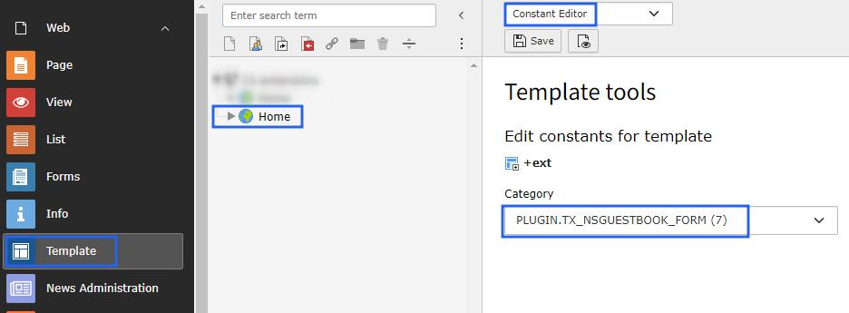
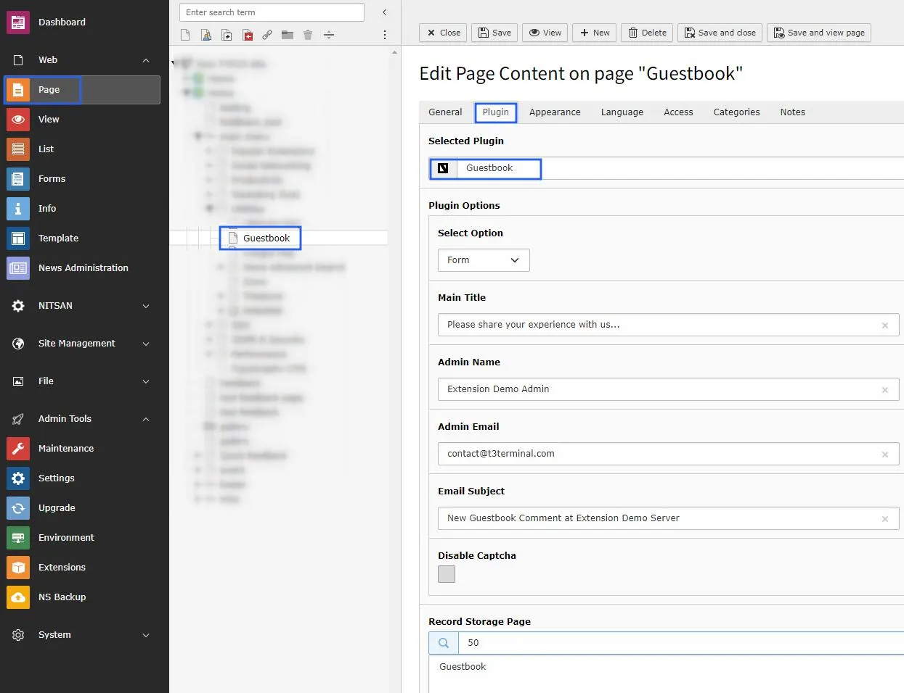
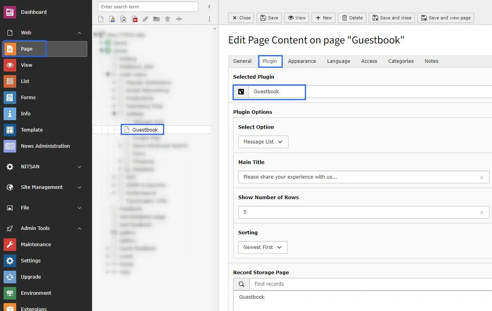

## Configure Guestbook

- **Step 1:** Go to Template.
- **Step 2:** Select root page.
- **Step 3:** Select Constant Editor > Plugin.Tx_NsGuestbook_NsGuestbook.
- **Step 4:** Now, you can configure all the options which you want eg., cache configuration, storage folder, views of comments etc., See below screenshot.

## Add Guestbook Plugin

- **Step 1:** Switch to page where you want to add Guestbook Form.
- **Step 2:** Add Guestbook Plugin and select Form as Option.
- **Step 3:** Set Title for Guestbook Form and E-Mail related details. See Below.

- **Step 4:** Switch to page where you want to display a list of Messages from guests.
- **Step 5:** Add Guestbook Plugin and select Message List as Option.
- **Step 6:** You can set heading for the list, No. of messages to display, sorting of messages in this plugin.

