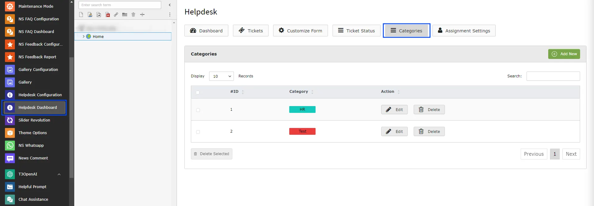
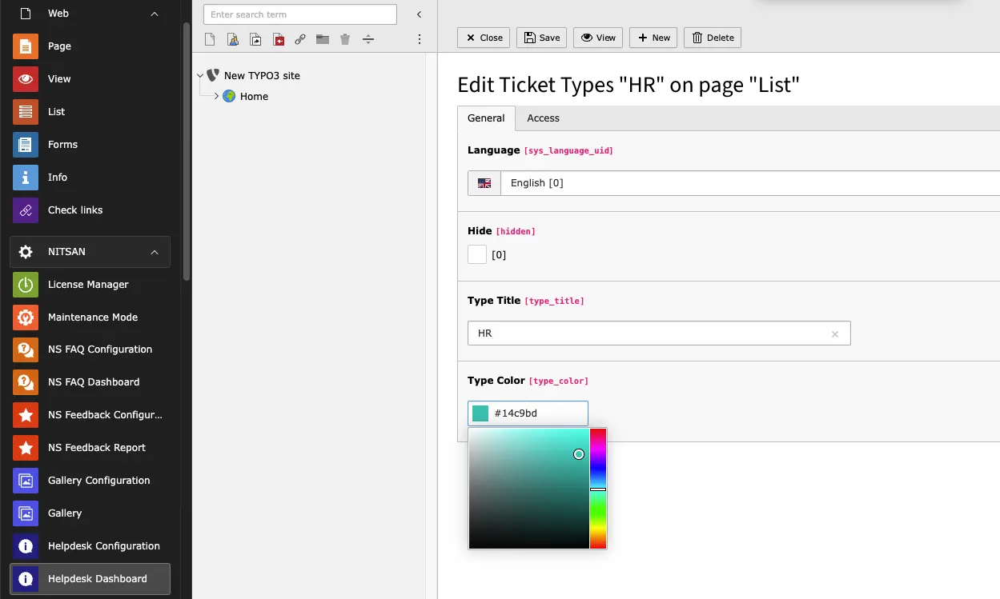

To manage your ticket categories by setting up create,edit,delete,search ticket categories.

## Create Ticket Status

<Steps>
  <Step title="Step 1">
Go to Admin Tools > NS Helpdesk
  </Step>
  <Step title="Step 2">
Click on "Categories" menu
  </Step>
  <Step title="Step 3">
Click on "Add New" button
  </Step>
  <Step title="Step 4">
Add category title, color and save Changes.

  </Step>
</Steps>

