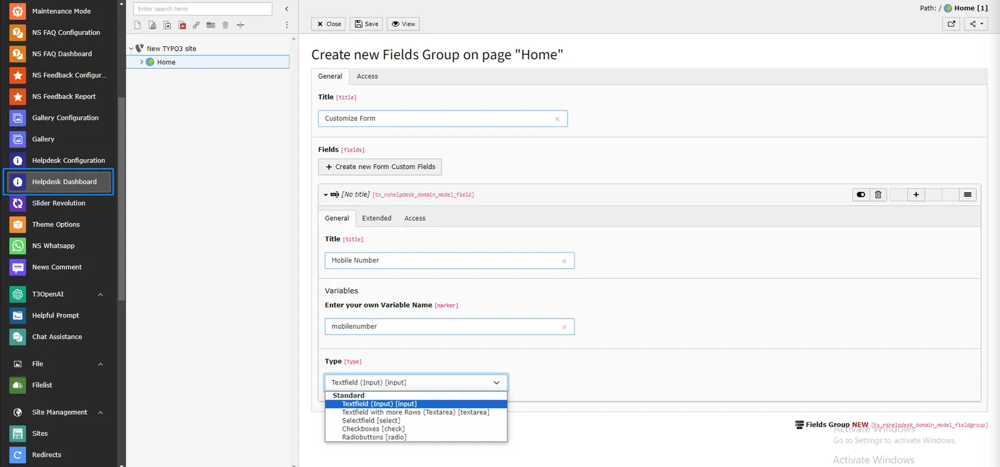
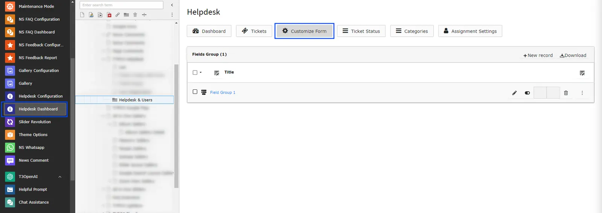

Add your custom form fields from the customize form module.

## Create Custom Fields

<Steps>
  <Step title="Step 1">
Go to Admin Tools > Helpdesk Dashboard
  </Step>
  <Step title="Step 2">
Click on "Customize Form" menu
  </Step>
  <Step title="Step 3">
Click on "Add New" Link
  </Step>
  <Step title="Step 4">
Insert title to the group of form fields. Than after add a Title of specific field, Variable name & select the type of the field. Its a nested, so you may add your own form fields to suite your site.
We have given a Input field, Text area, Select field, Checkbox & radio button.

  </Step>
</Steps>

