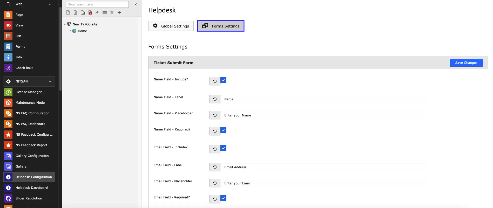
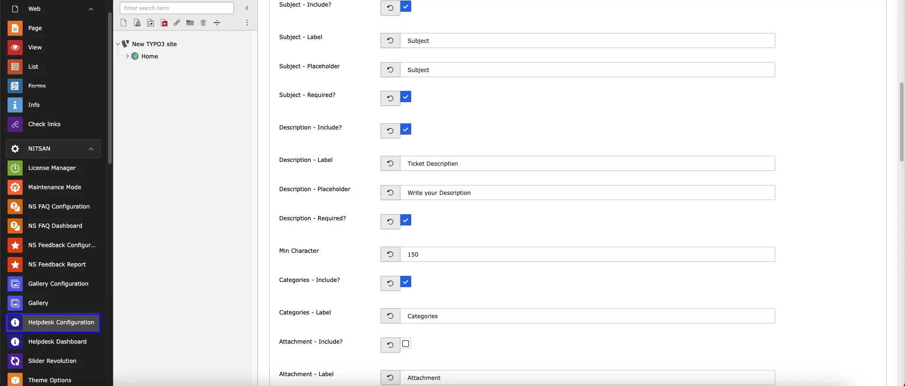
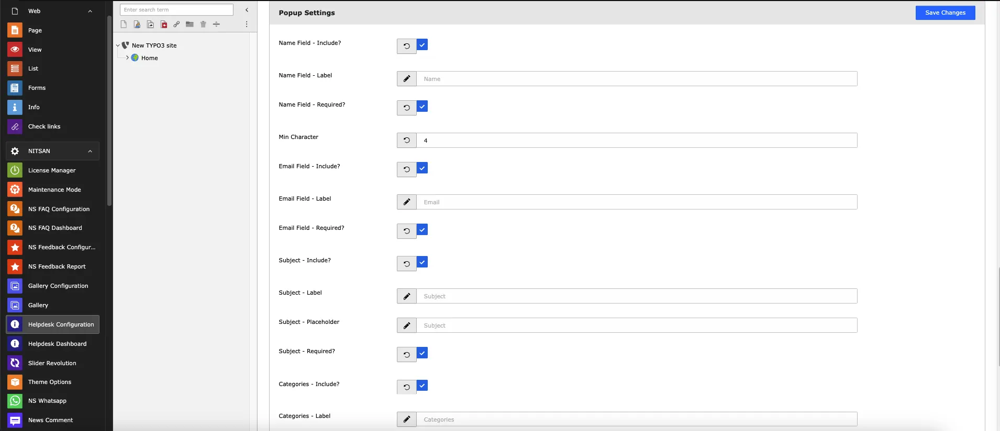
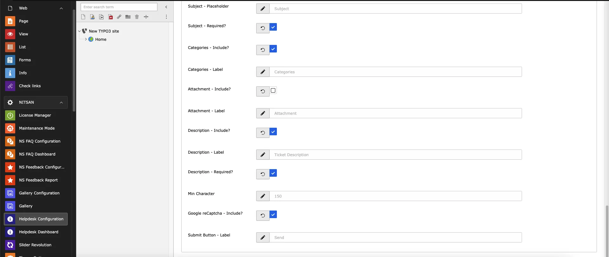
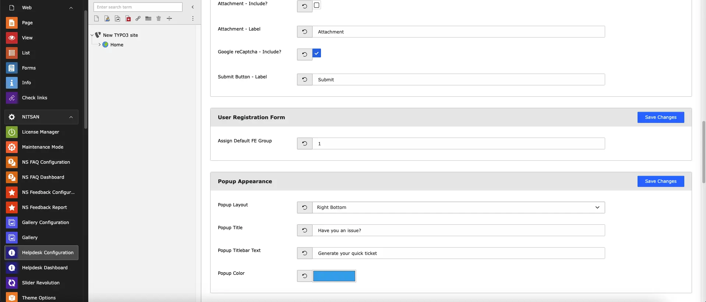
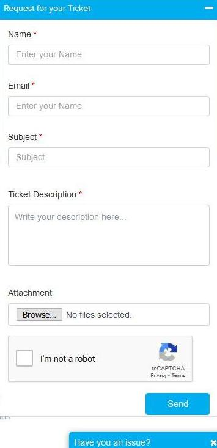

You can easily setup your ticket form from the typo3 backend. you can configure the popup support also.

<Steps>
  <Step title="Step 1">
Go to Admin Tools > Helpdesk Configuration
  </Step>
  <Step title="Step 2">
Click on "Form Setting" menu

  </Step>
  <Step title="Step 1">
Go to Admin Tools > Helpdesk Configuration
  </Step>
  <Step title="Step 2">
Click on "Form Setting" menu

  </Step>
</Steps>

<Note>

Front end look of the Popup support form

</Note>

