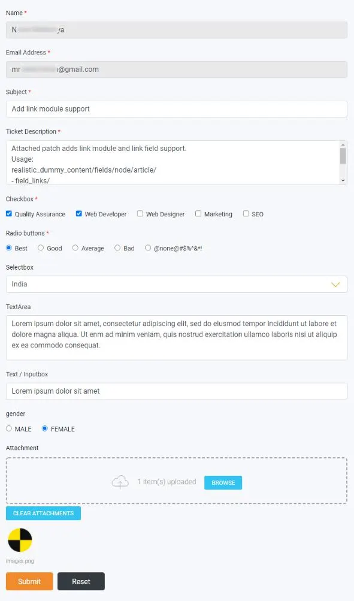

Configure the ticket form in the **Constant Editor**. Include the Helpdesk
TypoScript first. See [Include TypoScript](/en/latest/ExtNsHelpDesk/Installation/Index#ns-helpdesk-include-typoscript)
and [Constant Editor](/en/latest/ExtNsHelpDesk/GlobalSettings/Index#ns-helpdesk-constant-editor).

**Step 1.** Open the **TypoScript** module and select the root page.

**Step 2.** Switch to **Constant Editor**.

**Step 3.** Choose the Helpdesk form settings category from the category dropdown.

**Step 4.** Adjust field labels, placeholders, include/required flags, and popup options, then save.

The walkthrough below covers both global constants and form constants:

<iframe src="https://app.supademo.com/embed/cmti8g5y71dmuqmctgof78avq?embed_v=2&utm_source=embed" loading="lazy" title="Configure Helpdesk form settings in the Constant Editor" allow="clipboard-write; fullscreen" frameBorder="0" webkitallowfullscreen="true" mozallowfullscreen="true" allowfullscreen></iframe>

You can control, among others:

- Name, email, subject, and description fields (include, label, placeholder, required)
- Categories field label
- Attachment field
- Google reCaptcha
- Submit button label
- Minimum character count for the description

<Note>
Frontend look of the ticket creation form.
</Note>

## Popup Form Settings

Popup support is configured in the same Constant Editor category.

Set popup appearance, layout, title, and color, then save.

<Note>
Frontend look of the popup support form.
</Note>

