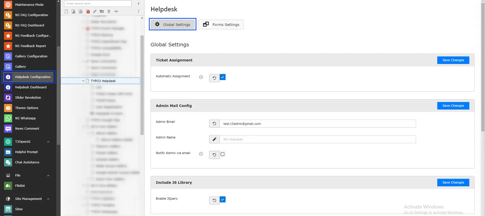
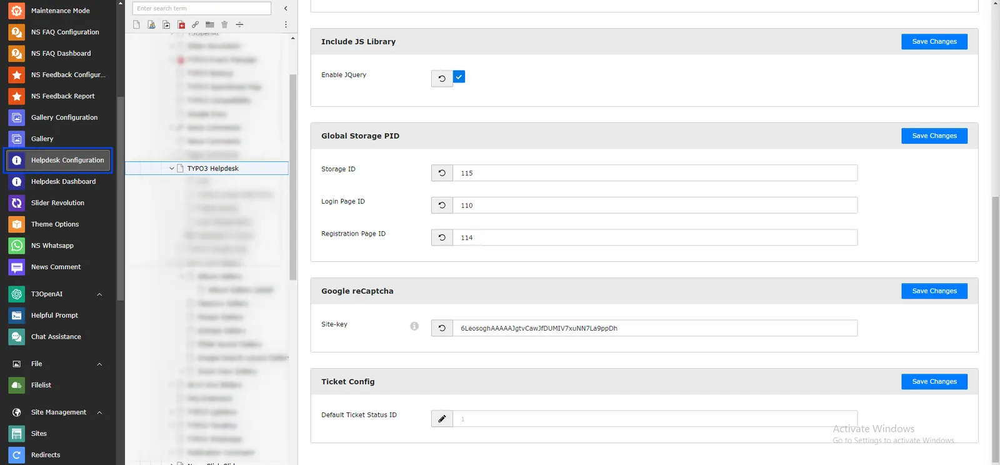

Once you install this extension, Your first-step should be to configure all the settings from "Global Configuration".

<Steps>
  <Step title="Step 1">
Go to Admin Tools > Helpdesk Configurations
  </Step>
  <Step title="Step 2">
Click on "Global Settings" menu, Fill-up all the information and click on "Save Changes" button.

  </Step>
</Steps>

<Note>

If you will not enable the automatic ticket assignment field then category wise assignee would not be work. so you must enable that field as well as you should have the categories on your helpdesk extension.

</Note>
