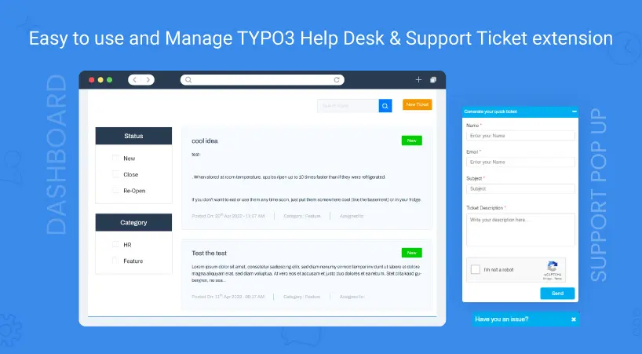

## NS Helpdesk

## What does it do?

TYPO3 Help Desk extension that helps you balance everything your customers need to be happy. The easiest to use TYPO3 Help Desk & Support Ticket extension allows you to create a support help desk quickly and easily with Support Tickets.
The TYPO3 Help Desk Extension provides a dedicated support dashboard and portal, rich ticketing system, email notifications, restricted access, file and media uploads. You can also add your own fields to extend the ticket forms using custom fields. It integrates seamlessly to your TYPO3 website, allowing you full control over your support system.

## Helpful Links

<Note>

- **Product:** https://t3planet.de/ns-helpdesk-typo3-extension
- **TYPO3 Backend Live Demo:** https://demo.t3planet.de/live-typo3/t3t-extensions/typo3/?TYPO3_AUTOLOGIN_USER=editor-helpdesk
- **Front End Demo:** https://demo.t3planet.de//t3t-extensions/helpdesk
- To make any domain-related changes or whitelist any development and staging domains, please reach our support center: https://t3planet.de/support

</Note>
