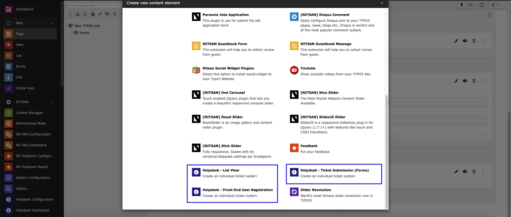
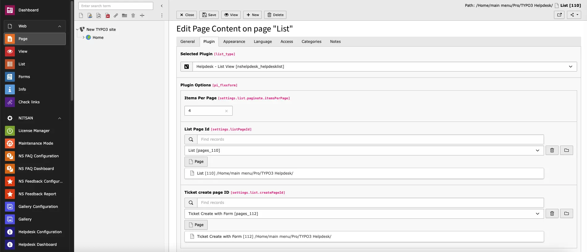
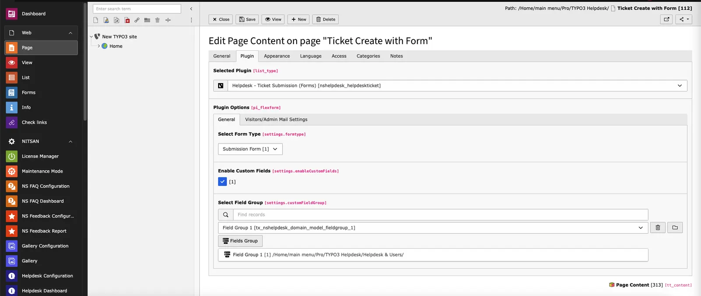
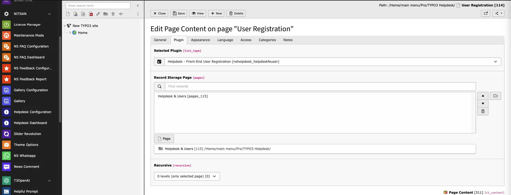

You can do the plugin configurations from backend according to your need. There are basically 3 plugins available which are helpdesk-List view, Helpdesk-Front-End user Registration, & Helpdesk-Ticket Submission (Forms). You can choose a user registraion form for front end user registration, listing view helps you to display the all tickets on front end & can create the ticket with the help of the ticket submission form option easily.

## Helpdesk list view

**Step 1.** Create New Content Element > Click on “Plugin” menu

**Step 2.** Select plugin helpdesk-List view

**Step 3.** Configure necessary settings like ticket create page id, list page id, item to show per page etc.

## Helpdesk-Ticket Submission (Forms)

**Step 1.** Create New Content Element > Click on “Plugin” menu

**Step 2.** Select plugin Helpdesk-Ticket-Submission

**Step 3.** Configure necessary settings like type of Form,cutome fields etc

## Helpdesk-Front-End user Registration

**Step 1.** Create New Content Element > Click on “Plugin” menu

**Step 2.** Select plugin Helpdesk-Front-End user Registration

**Step 3.** Configure Storage folder for user group.

