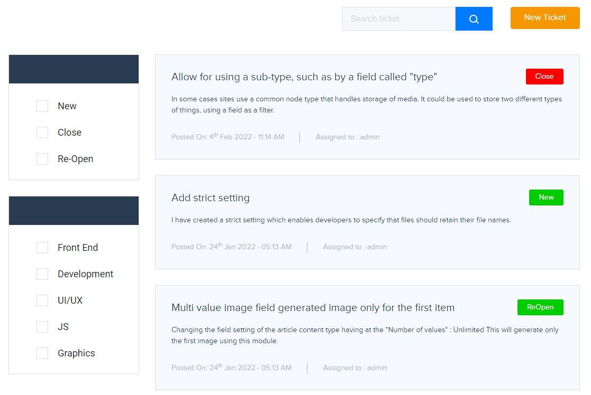
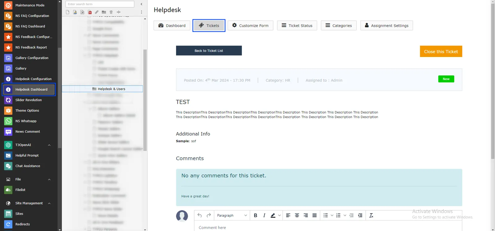
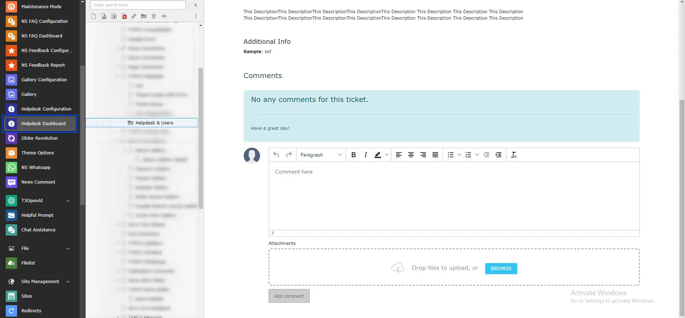
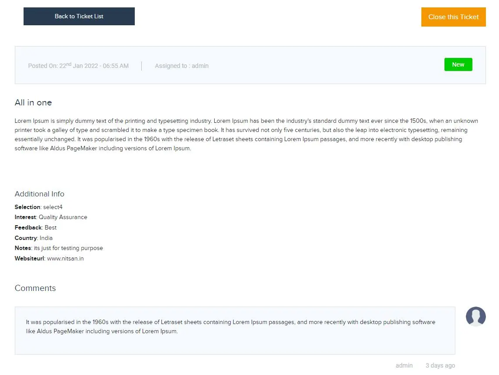
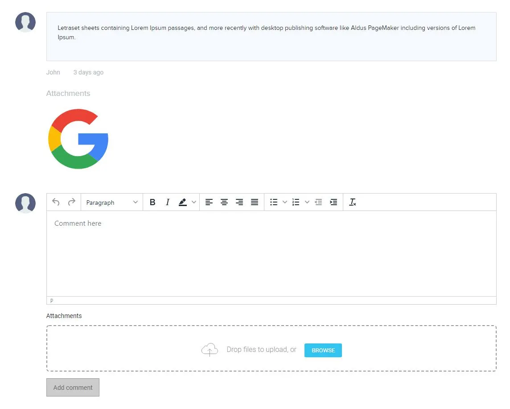

You can easily create & see all tickets from tickets menu from your typo3 backend. you can find any tickets via filtration located at sidebar. as well as you can search any tickets within seconds via search feature.

<Steps>
  <Step title="Step 1">
Go to Admin Tools > NS Helpdesk
  </Step>
  <Step title="Step 2">
Click on Tickets Menu.

  </Step>
</Steps>

<Note>

Front end look of ticket listing page.

</Note>

## Ticket Detail

<Steps>
  <Step title="Step 1">
Click on specific ticket.
  </Step>
  <Step title="Step 2">
Now admin Can add comment & close/reopen ticket from Backend as well.

  </Step>
</Steps>

<Note>

Front end look of ticket Detail page.

</Note>

