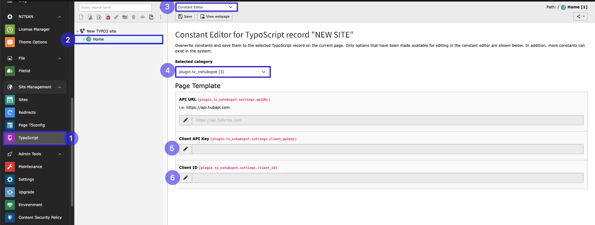
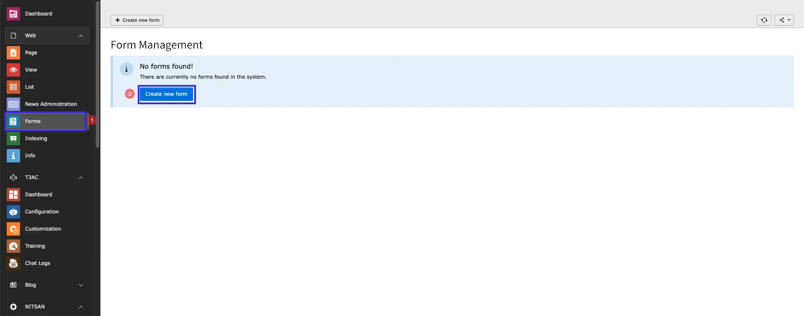
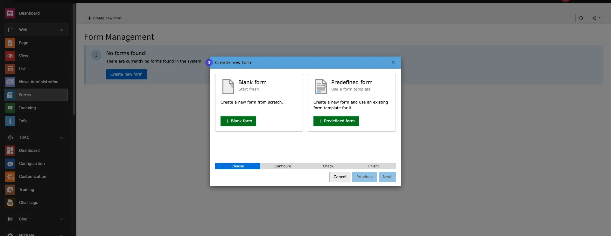
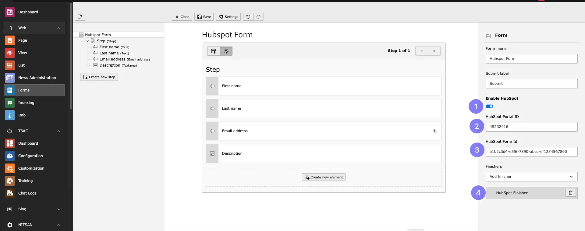
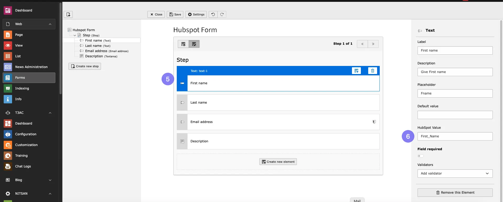
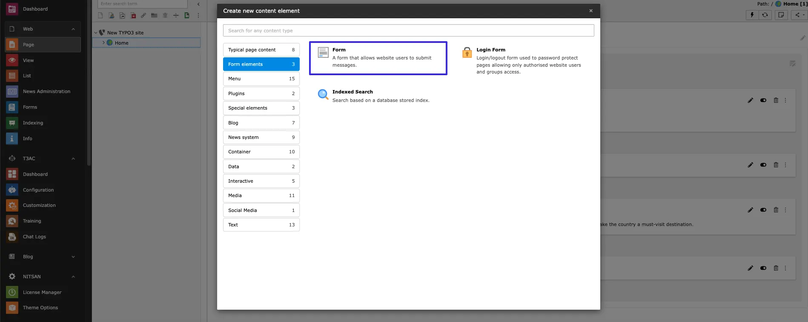
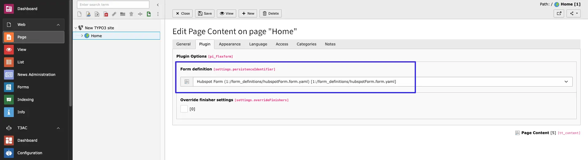

Please follow below step to configuration,

- **Step 1:** Go to Typoscript module.
- **Step 2:** Click on Root page
- **Step 3:** Go to Constant editor
- **Step 4:** Select plugin.tx_nshubspot
- **Step 4:** Add Client Id
- **Step 5:** Add Client API

To obtain the Client ID and Client API Key, please refer to the following links:

- [OAuth App Management](https://developers.hubspot.com/docs/reference/api/app-management/oauth)
- [Private Apps Overview](https://developers.hubspot.com/docs/guides/apps/private-apps/overview)

Pleae follow below steps for hubspot configuration.

## Hubspot Configuration

- **Step 1:** Go to Form module
- **Step 2:** Click on Button Create new

- **Step 3:** Create Blank / Predefined Form

After Adding Form,follow below steps:

- **Step 1:** Enable toggle Hubspot
- **Step 2:** Add Hubspot Portal id
- **Step 3:** Add HubSpot Form Id
- **Step 4:** Select **Hubspot Finisher** Finisher from dropdown

- **Step 5:** Select Form Field
- **Step 6:** Add HubSpotValue of Field from your Hubspot form

**Repeat the above steps 5 and 6 for all fields you want to add in your form.**

To get form id follow steps showing in linke below:

https://knowledge.hubspot.com/forms/find-your-form-guid

## Add the HubSpot Form Plugin

To configure hubspot Form in your site,please follow below steps,

- **Step 1:** Go to page
- **Step 2:** Open Create Content element Wizard
- **Step 3:** Go to Form Element tab

- **Step 4:** Choose Hubspot Form from dropdown which you want to Integrate.

Save Configurations and use Plugin as per your requirements.
