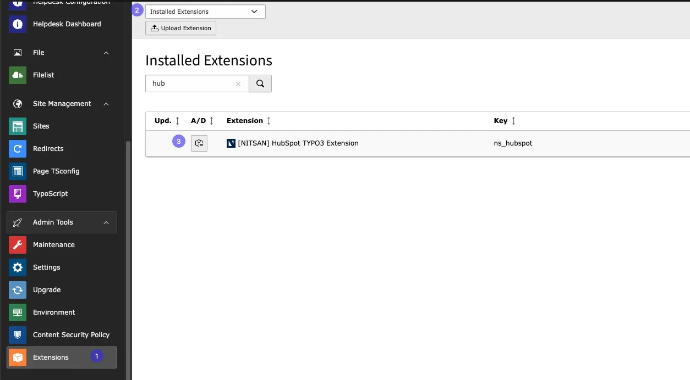
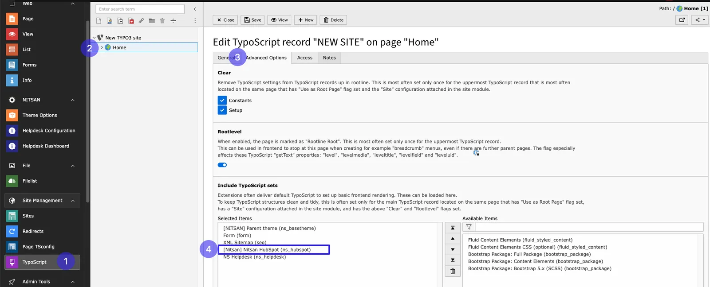

# Installation

Installing the ns_hubspot Extension is easy. Follow the steps below to add the extension to your TYPO3 environment.

# For Free Version

## 1. Get the extension

**Via Composer using Command Line**

```
composer req nitsan/ns-hubspot --with-all-dependencies
```

**Via Extensions Module**

In the TYPO3 backend you can use the extension manager (EM).

Step 1. Switch to the module “Extension Manager”.

Step 2. Get the extension

Step 3. Get it from the Extension Manager: Press the “Retrieve/Update” button and search for the extension key ns_hubspot and import the extension from the repository.

Step 4. Get it from typo3.org: You can always get the current version from https://extensions.typo3.org/extension/ns_hubspot/ by downloading either the t3x or zip version. Upload the file afterwards in the Extension Manager.



## 2. Activate the TypoScript

The extension ships some static TypoScript code which needs to be included.

Step 1. Switch to the Template/TypoScript module and select Info/Modify.

Step 2. Switch to the root page of your site.

Step 3. Click the link Edit the whole template record and switch to the tab Includes.

Step 4. Select '[Nitsan] ns_hubspot' at the field Include static (from extensions).

Step 5. Include '[Nitsan] ns_hubspot' at the last place.



# For Premium Version - License Activation

To activate license and install this premium TYPO3 product, Please refer this documentation [License documentation](/License/Index)

## How to Install TYPO3 Extension ns_hubspot

**Extension Installation Via without Composer mode**
https://www.youtube.com/watch?v=SN5HoFQcDM4

**Extension Via Composer**
https://www.youtube.com/watch?v=_7ILu4lwU-k
