Please follow below step to configuration,

- **Step 1:** Go to Admin Tools Settings.
- **Step 2:** Click to Configuration extension.

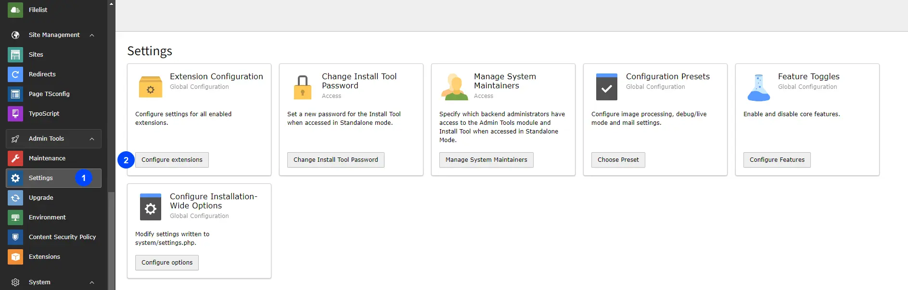

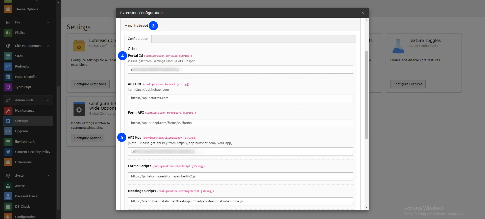

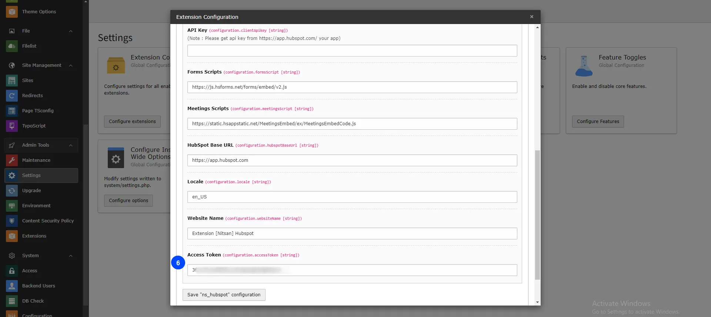

- **Step 3:** Click on ns_hubspot.
- **Step 4:** Add Portal Id.
- **Step 5:** Add API Key ( Client Secret Key ).
- **Step 6:** Add Access Token.

Pleae follow below steps for hubspot configuration.

## HubSpot Configuration

- **Step 1:** Create your new account in HubSpot: https://app.hubspot.com/
- **Step 2:** Click on setting icon, and go to Account Setup > Integration > Legacy Apps > click on Auth

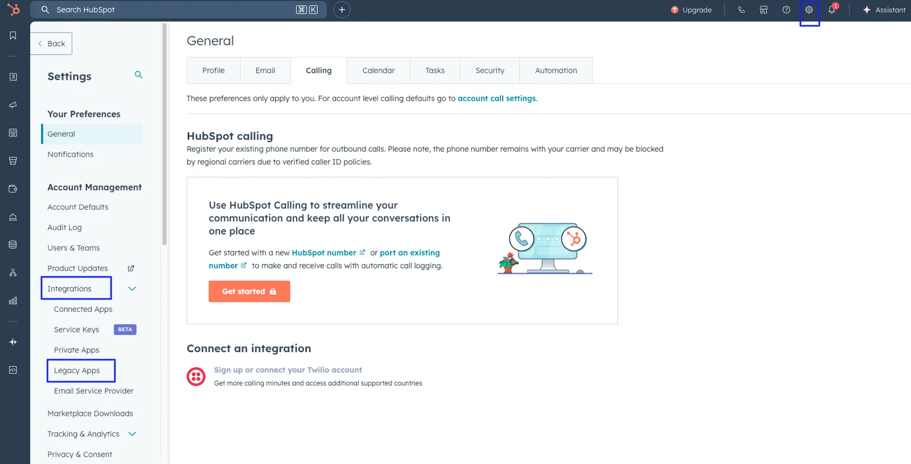

- **Step 3:** Get your “Portal Id ”, "API Key(Client secret)" and “Access token” from the Account set up.

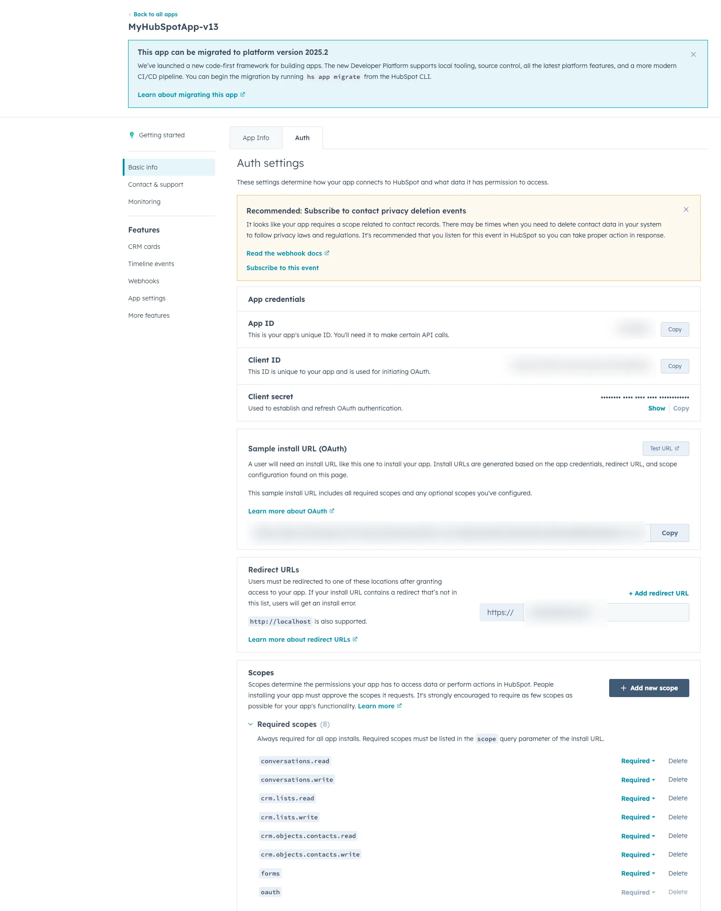

**Generate API Key (Client secret) and Access Token, here is referance link for step by Step guidance:** [HubSpot App Creation Guide](https://legacydocs.hubspot.com/docs/faq/how-do-i-create-an-app-in-hubspot)

**After API Key, Portal Id and Access Token generation, configure it in** **settings**

## HubSpot Dashboard

After all configuration,You can See Backend Different modules,Log into your hubspot account from Dashboard.

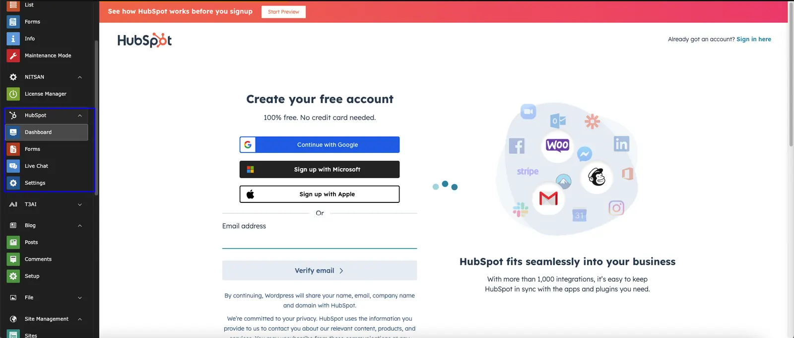

After login you can see all configurations of Live chat, Forms and Contacts. Check below screenshot.

## Create your HubSpot form

Create your hubspot form in forms modual:

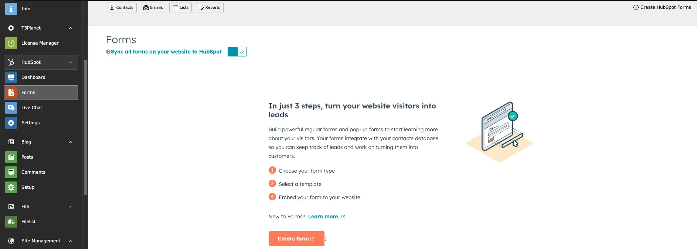

<Note>

HubSpot has moved private apps to the **Legacy Apps** page.
Existing apps continue to work and can be migrated later if needed.

</Note>

## Create Website Chatflows in Live Chat

Go to HubSpot Live Chat module and click to create chatflow button

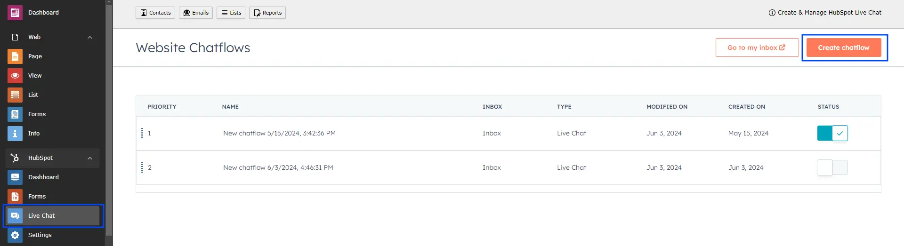

## Add the HubSpot form Plugin

To configure hubspot Form in your site,please follow below steps,

- **Step 1:** Go to page
- **Step 2:** Open Create Content element Wizard
- **Step 3:** Go to plugin tab add HubSpot form Plugin

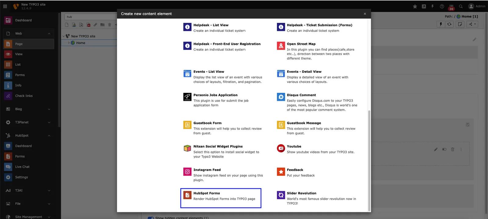

- **Step 4:** Choose Hubspot Form from dropdown which you want to Integrate.

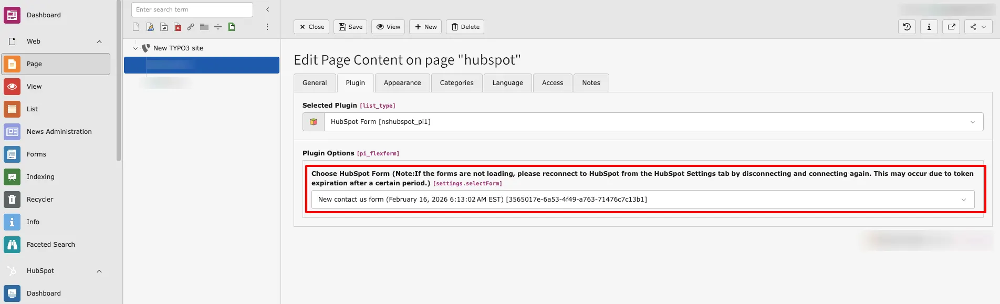

Save Configurations and use Plugin as per your requirements.

## Figures

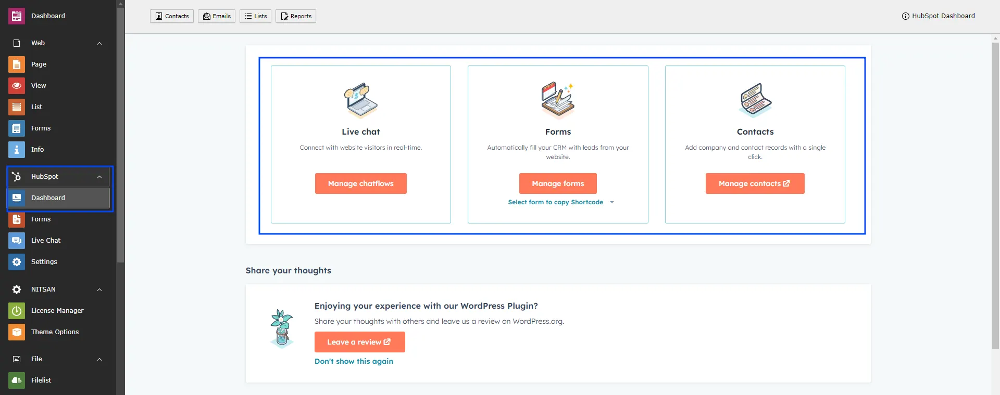
