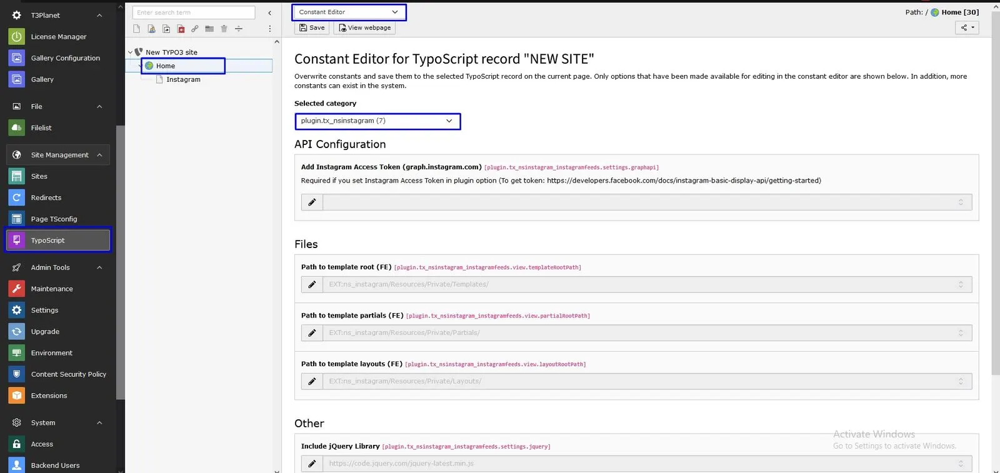
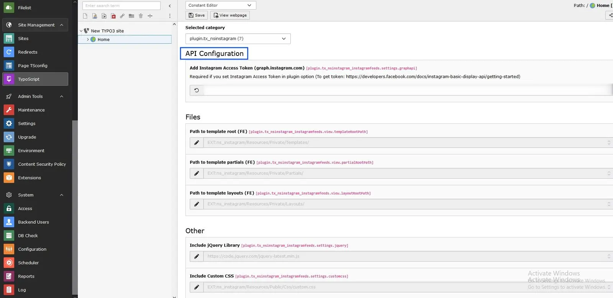
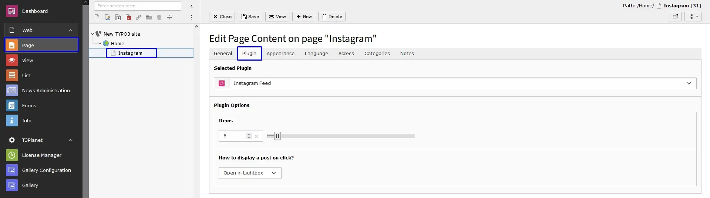

## Configure Global settings

You can set all the global settings of this extension at constants.

- Step 1: Go to Template/TypoScript.
- Step 2: Select root page.
- Step 3: Select Constant Editor
- Step 4: Select option Plugin.TX_NSINSTAGRAM. Now, you can configure all the options which you want eg., API Configuration, jQuery, etc.

**API Configuration**

To display Instagram Feed and other details, we need to generate Access Token. There is ways to generate the Access Tokens:

- **1. Instagram API Access Token** - This token can be generated from here: https://developers.facebook.com/apps/

## Configure Instagram Plugin

First of all, Add Instagram Plugin from Create new content element > Plugins > Instagram Feed

**- Select Items:** Enter items as you want to show in page (1 to 100).

**- How to display a post on click?:** Here you can decide whether you want to Open in Lightbox or Open at Instagram.
