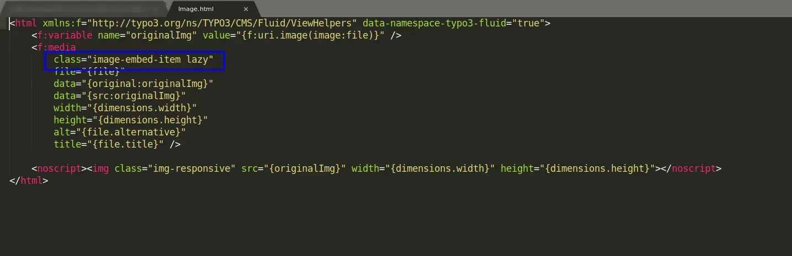
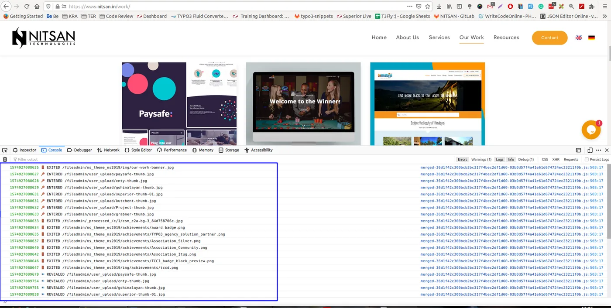

The lazyload functionality is working based on class lazy.

To implement this functionality on core elements, you need to move the partials element to your custom template and add class lazy in image tag.

This functionality is also flexible for the custom elements. In your custom element, you need to add a lazy class, and this functionality will work there as well.

Check below image for more info.

You can verify if it is implemented properly or not using Developer Tools. Check below image.

